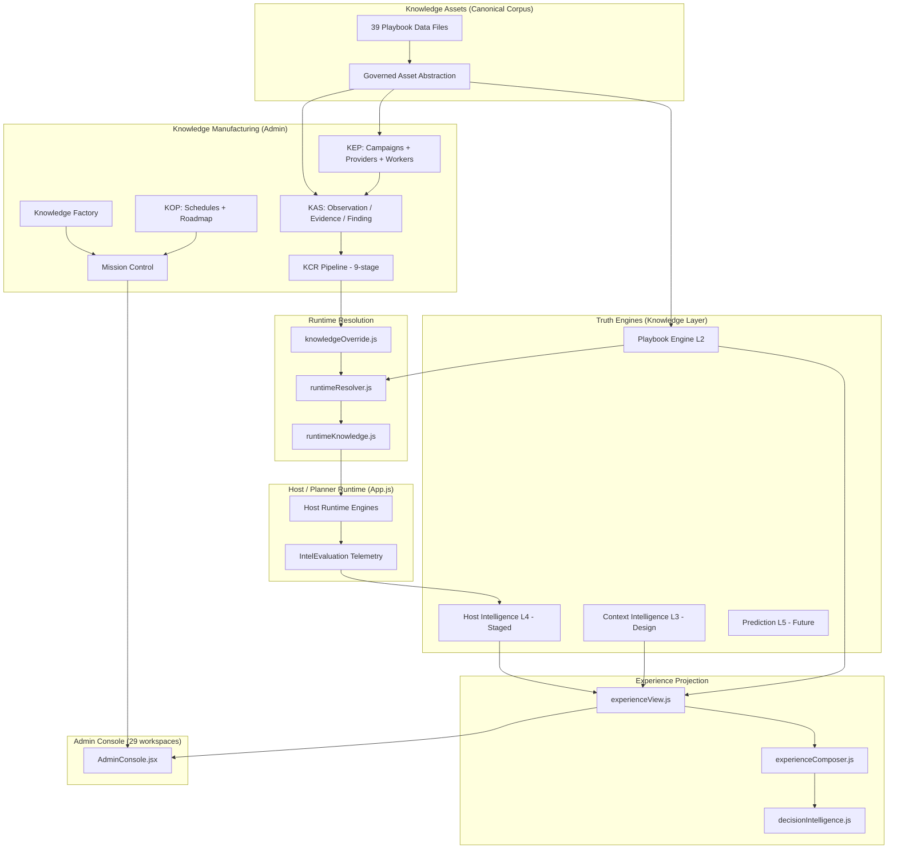
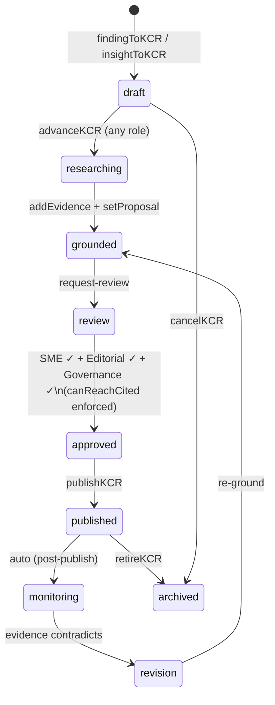
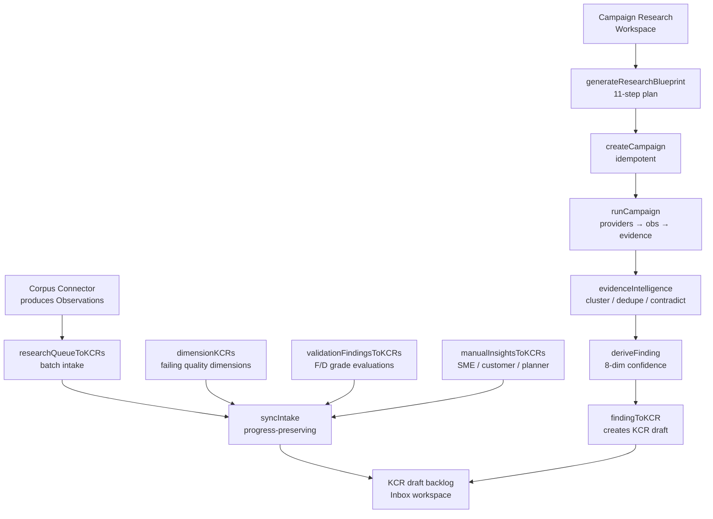
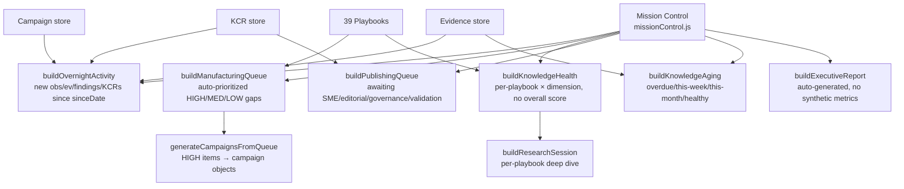
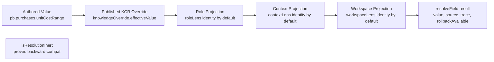

# NGW Event Intelligence Platform — Architecture Evolution Report

**Version:** 1.0  
**Date:** 2026-07-03  
**Author:** Generated from codebase audit  
**Status:** Living document — update after each platform sprint

---

## Table of Contents

1. [Executive Summary](#1-executive-summary)
2. [Platform Timeline](#2-platform-timeline-chronological)
3. [System-by-System Architecture](#3-system-by-system-architecture)
   - [Product OS](#31-product-os)
   - [Knowledge OS](#32-knowledge-os)
   - [Knowledge Factory](#33-knowledge-factory)
   - [Knowledge Acquisition System (KAS)](#34-knowledge-acquisition-system-kas)
   - [Knowledge Evolution Platform (KEP)](#35-knowledge-evolution-platform-kep)
   - [Knowledge Operations Platform (KOP)](#36-knowledge-operations-platform-kop)
   - [Knowledge Change Requests (KCR)](#37-knowledge-change-requests-kcr)
   - [Knowledge Assets (Playbooks)](#38-knowledge-assets-playbooks)
   - [Knowledge Dimensions](#39-knowledge-dimensions)
   - [Knowledge Trust / Evidence Authority](#310-knowledge-trust--evidence-authority)
   - [Mission Control](#311-mission-control)
   - [Research Session](#312-research-session)
   - [Campaign System](#313-campaign-system)
   - [Provider Registry](#314-provider-registry)
   - [Provider Intelligence](#315-provider-intelligence)
   - [Worker Fleet](#316-worker-fleet)
   - [Runtime Resolver](#317-runtime-resolver)
   - [Experience Projection](#318-experience-projection)
   - [Knowledge Scopes](#319-knowledge-scopes)
   - [Knowledge Domains](#320-knowledge-domains)
   - [Failure Intelligence](#321-failure-intelligence)
   - [Research Blueprints (RBE-1)](#322-research-blueprints-rbe-1)
   - [Research Automation](#323-research-automation)
   - [Playbook Intelligence](#324-playbook-intelligence)
   - [Validation Platform](#325-validation-platform)
   - [Role Registry](#326-role-registry)
   - [Experience Roles](#327-experience-roles)
   - [Command Center](#328-command-center)
   - [Admin Console](#329-admin-console)
4. [Admin Console Workspace Inventory](#4-admin-console-workspace-inventory)
5. [Knowledge Manufacturing Timeline](#5-knowledge-manufacturing-timeline)
6. [Architecture Diagrams](#6-architecture-diagrams)
7. [Current State Assessment](#7-current-state-assessment)
8. [Technical Debt](#8-technical-debt)
9. [Platform Readiness](#9-platform-readiness)
10. [Roadmap](#10-roadmap)

---

## 1. Executive Summary

The NGW Event Intelligence Platform is a human-governed, AI-accelerated knowledge manufacturing system built inside the Event Boss application. It evolved from a static playbook runtime into a full knowledge lifecycle engine: acquiring evidence from external sources, routing it through a governed change pipeline, publishing verified updates into canonical playbooks, and projecting the resulting knowledge into per-role, per-phase, per-situation user experiences.

**What exists as of 2026-07-03:**

- **39 canonical playbook data files** covering event types from Dinner Party to Wedding to Ethiopian Coffee Ceremony, each with typed purchases, quantities, tasks, schedules, risks, contingencies, decisions, and vendor guidance
- **54+ knowledge library modules** in `src/lib/knowledge/` implementing: observation, evidence, finding, KCR, campaign, worker fleet, provider registry, dependency graph, blast radius, runtime resolver, knowledge override, dimension evaluation, failure intelligence, research blueprints, copilot proposals, schedule tracking, roadmap generation, research pipeline manifests, experience projection, and consensus resolution
- **29 admin workspaces** in `AdminConsole.jsx` (6,100 lines) giving operators a complete knowledge manufacturing cockpit
- **5 intelligence levels** designed in the Intelligence OS: static → derived → context → memory → prediction, with Level 2 (playbook-derived) fully live and Level 4 (host memory) instrumented and staged
- **A formal validation platform** (INTEL-QA-1) for grading recommendations against real outcomes, with Stage 1 telemetry shipped as of 2026-07-02

**Core architectural invariants (enforced in code):**

- Nothing changes canonical knowledge without a KCR passing through review
- No auto-publish; three human review gates (SME + editorial + governance) are required
- Confidence and analytics are dimensional — no single score exists anywhere
- External evidence is candidate until corroborated; community evidence requires corroboration
- Runtime behavior is backward-compatible: the resolution chain is inert unless opted in
- Validation metrics require n ≥ 8 scored records before display; honest-empty otherwise
- The experience projection layer is pure read-only: it never owns knowledge

---

## 2. Platform Timeline (Chronological)

| Date | Milestone | Sprint / Label |
|---|---|---|
| Pre-2026-05 | Static playbook runtime: `getPlaybook()` returns authored data, engines read directly | Foundation |
| 2026-05-01 | Studio Matte confidence hierarchy locked; green/steel tiers only | Visual system |
| 2026-05-02 | NGW Core v0.1.0-rc2 production verified; PRs #21–#26 complete | v0.1.0-rc2 |
| 2026-06-08 | Communications frozen; refocus on activation/recruitment | Sprint 51B |
| 2026-06-10 | Portfolio Triage Board, Budget KPI inline edit, Vendor operational depth shipped | Sprint 53B |
| 2026-06-11 | Next-Step Spine, width/measure system, FAB killed | Sprint 53C |
| 2026-06-12 | L1 + Settings board audit, Getting Paid section | Sprint 53D |
| 2026-06-13 | Admin/Support Console P0 complete (Triage/Workspaces/Invitations/Errors) | Sprint 54 |
| 2026-06-13 | Intake Rebuild + Brutal Board Audit: L1/Vendor/Client scored 6.1 | Sprint 54 |
| 2026-06-14 | Product OS canonical doctrine established (`docs/product-os/PRODUCT_OS.md`); Playbook Engine live | Sprint 55C-1, PR #32 |
| 2026-06-18 | Event Identity shipped (behind `pi.identity` flag) | Sprint 60B, PR #60 |
| 2026-06-21 | Do It For Me shipped (invite/vendor-inquiry/thank-yous); Activation funnel instrumented | Sprint 60C |
| 2026-06-23 | Event Identity System per-event icon + color; Font Token System 100% tokenized | Sprint 60D |
| 2026-06-24 | Safe-Headcount Band (`attendanceBand()`) shipped | Sprint 60E |
| 2026-06-25 | NOW-View Host Shell doctrine established | Sprint 61 |
| 2026-06-28 | No-guesswork advance engine; next-step routing seams (focusField/foodFocus/vendorSection) | Sprint 62 |
| 2026-06-29 | Food Plan hero redesign; BLS food pricing; per-guest leads; food sourcing → tasks | Sprint 63 |
| 2026-07-02 | **Knowledge OS v1.0 frozen** — permanent hierarchy: Assets → Truth Engines → Projection → Workspaces → Experience | KOS-1 |
| 2026-07-02 | **Knowledge Factory v1.0** — 6-queue manufacturing view; batch KCR publishing | KF-1 |
| 2026-07-02 | **Knowledge Acquisition System v1.1** — 3 canonical objects (Observation/Evidence/Finding); providers unfrozen; first real campaign executed | KAS-2 |
| 2026-07-02 | **Knowledge Studio v1.0** — KCR gated pipeline; 3-review-gate requirement; canReachCited enforcement | KSTUDIO-1 |
| 2026-07-02 | **KEP-2 (Knowledge Evolution Platform)** — external acquisition unfrozen; 16 provider families; Campaign orchestration; Evidence Intelligence (cluster/dedupe/contradiction) | KEP-2 |
| 2026-07-02 | **Playbook Intelligence OS v1.0** — Dimension framework (7-field contract, no rollup score) | PBIOS-1 |
| 2026-07-02 | **Intelligence Validation Platform Stage 1** — `IntelEvaluation` record, `intel_rec_shown/overridden`, R1 wired; 17 tests; `src/lib/intelEval.js` | INTEL-QA-1 |
| 2026-07-02 | **Intelligence OS v1.0 frozen** — two pillars: Context Intelligence (L3) + Host Intelligence (L4); Reality Reconciliation roadmap; 9-step canon | IOS-1 |
| 2026-07-02 | INTEL-1 Host Intelligence Profile spec (design only); INTEL-2 Context Intelligence spec (design only) | Spec |

---

## 3. System-by-System Architecture

### 3.1 Product OS

**What it is:** The six-layer canonical doctrine governing all NGW products. Every engineering and design decision derives from it.

**Before:** Scattered per-sprint verdicts in individual board documents, no canonical reference.

**Why it was built:** Sprint 53 found five separate type classifiers drifting independently, knowledge surfaces contradicting each other, and design patterns being reinvented sprint-over-sprint.

**What it solves:** One source of truth for executive principles (EP-1 through EP-4), Studio Matte design system (SM-1 through SM-3), runtime architecture rules (RA-1 through RA-5), product patterns (PP-1 through PP-5), expert knowledge constants, and doctrine ledger (DL-001 through DL-009).

**Key files:**
- `docs/product-os/PRODUCT_OS.md` — the canonical source
- `src/lib/eventTaxonomy.mjs` — the canonical classifier (EP-1: one concept, one answer)
- `src/App.js` — `recordKind` axis wiring (RA-4)

**Key doctrine entries relevant to the knowledge platform:**
- EP-1: No Guesswork = one concept resolves one answer everywhere
- EP-2: Bless is gated not summed — one structural blocker caps the composite
- DL-007: Bless is gated not summed (doctrine)
- DL-008: Identity informs by annotation, never computation (candidate)
- DL-009: Cost surfaces are persona-split: host gets spending plan; planner gets AR/fee/vendor cockpit

**Current state:** Canonical, living. Append after each sprint. Never contradict.

---

### 3.2 Knowledge OS

**What it is:** The permanent architectural hierarchy governing ALL knowledge in the NGW platform.

**Before:** Playbook data was read directly by engines with no governing layer, no lifecycle, no provenance tracking, and no change governance.

**Why it was built:** As the playbook corpus grew, engines began reading stale, ungrounded, or contradictory data with no visibility into quality or provenance. The Knowledge OS establishes the permanent hierarchy that cannot be broken.

**What it solves:** Enforces one canonical body of knowledge (never forks), five truth engine types, a pure-read projection layer, and six governance axes.

**Permanent hierarchy (enforced):**
```
Knowledge Assets (canonical corpus)
  └── Truth Engines (Knowledge / Occasion / Context / Host / Vendor / Financial / Outcome / Learning)
       └── Projection Engine (pure read-only: Role × Phase × Workspace)
            └── Workspaces (knowledge manufacturing cockpit)
                 └── Experience (host/planner/coordinator surfaces)
```

**Three governance axes for Knowledge Assets:**
- Lifecycle: 11 stages (draft → synthesized → grounded → reviewed → production → ...) governed by KCR
- Maturity: 6 evidence-gated stages; cannot advance without evidence
- Health: 12 component checks (never a single score)

**Key files:**
- `docs/architecture/KNOWLEDGE_OPERATING_SYSTEM.md` — canonical v1.0, frozen 2026-07-02
- `src/lib/knowledge/governedAsset.js` — `GOVERNED_ASSET_KINDS` + `CAPABILITIES`
- `src/lib/knowledge/knowledgeChange.js` — the one write path

**Current state:** Canonical, frozen as a hierarchy. The execution layer is KEP (§3.5).

---

### 3.3 Knowledge Factory

**What it is:** The manufacturing-view layer that summarizes the state of the knowledge production pipeline as six queues and dimensional debt metrics.

**Before:** No visibility into what was queued for research, stuck in review, or aging out of freshness.

**Why it was built:** Needed a single function that could answer "what is the state of the knowledge factory right now?" without fabricating metrics when data is sparse.

**What it solves:** Provides the Mission Control and Studio floor with honest-empty aggregate counts across the full pipeline.

**Key functions:**
- `buildFactory(asOf, { playbooks, kcrs })` — derives the manufacturing view: six pipeline queues (observation / evidence / finding / review / publishing / validation), dimensional debt (grounding / freshness / coverage / operational / commercial / foodSafety), flow metrics, growth. Capacity cap: 2,000 playbooks.
- `batchKCRsFromFinding(finding, evidence, assetsById, asOf)` — one Finding → many KCRs (batch publishing); returns combined blast radius.

**Six pipeline queues:**
1. Observation queue — noticed gaps and signals awaiting evidence
2. Evidence queue — evidence collected, awaiting finding derivation
3. Finding queue — findings proposed, awaiting KCR creation
4. Review queue — KCRs in the 3-gate review process
5. Publishing queue — KCRs approved, awaiting publication
6. Validation queue — published KCRs in monitoring period

**Key files:**
- `src/lib/knowledge/factory.js`
- `docs/architecture/KNOWLEDGE_FACTORY.md` — v1.0, canonical

**What it replaced:** Ad-hoc counts pulled from individual stores by each workspace.

**Current state:** Built. Feeds Mission Control and the Studio KPI strip. Honest-empty until records exist.

---

### 3.4 Knowledge Acquisition System (KAS)

**What it is:** The three-object acquisition layer: KnowledgeObservation (noticed), KnowledgeEvidence (supports/refutes), KnowledgeFinding (validated conclusion).

**Before:** No structured acquisition layer. Playbook authors typed values directly with no source tracking, no freshness metadata, and no contradiction detection.

**Why it was built:** The platform needed a principled path from external source data to canonical knowledge updates that preserved attribution, authority levels, and freshness without allowing unreviewed data to corrupt the corpus.

**What it solves:** Structures the gap → observation → evidence → finding → KCR pipeline; enforces authority floors by gap type; ensures community evidence requires corroboration; no crawlers or auto-executing background agents.

**Three canonical objects:**

**KnowledgeObservation** (`observation.js`):
- Kinds: pricing, contradiction, regulation, vendor-closed, event-failed, user-feedback, missing-citation, missing-section, stale, coverage
- Deterministic id: `obs-${slug(assetId)}-${slug(fieldPath||kind)}-${slug(kind)}`
- Status lifecycle: open → evidencing → concluded → dismissed
- Immutable (Object.freeze)
- localStorage store: `ngw-kas-observations`; server-first async load via `/api/kas`

**KnowledgeEvidence** (`evidence.js`):
- Authority levels: primary, official, standards, trade, expert, derived, community
- Source types: official, industry, regional, commercial, event, expert, community, vendor, failure, ai-agent
- Deterministic id: `ev-${slug(source)}-${slug(assetId)}-${slug(fieldPath)}`
- Status: candidate → corroborated → accepted → expired → rejected
- Community/AI evidence stays at candidate until corroborated
- localStorage store: `ngw-kas-evidence`; server-first via `/api/kas`

**KnowledgeFinding** (`finding.js`):
- `findingConfidence(evidence, {...})` — 8 INDEPENDENT dimensions (evidence quality, source authority, corroboration, freshness, validation state, contradictions, expert review, stability). No rolled-up number. Weakest load-bearing dimension governs trust.
- `deriveFinding(observation, evidence, {...})` — proposes conclusion from extractedFacts. Status: contested (contradictions present) | proposed | insufficient
- `findingToKCR(finding, evidence, pb, asOf)` — Finding → KCR. Contested findings open contradiction KCR; clean findings open research KCR with cited evidence. Null for insufficient findings.

**Key files:**
- `src/lib/knowledge/observation.js`
- `src/lib/knowledge/evidence.js`
- `src/lib/knowledge/finding.js`
- `src/lib/knowledge/findingAnalysis.js` — `analyzeFinding()` — explains WHY a finding is sufficient or not
- `docs/architecture/KNOWLEDGE_ACQUISITION_SYSTEM.md` — v1.1 canonical

**Architecture rules (enforced in code):**
- No crawlers, scrapers, schedulers, background jobs, or auto-executing agents
- Authority floor per gap type (safety/governance → primary/standards; pricing/quantity → trade; cultural → community; weather → official)
- Community/AI evidence is candidate until corroborated

**Current state:** Built and tested. First real campaign executed 2026-07-02 (Crab Feast Pricing, $250–400/bushel, 3 corroborating DMV market sources, produced draft KCR). 233/233 tests green.

---

### 3.5 Knowledge Evolution Platform (KEP)

**What it is:** The execution layer that continuously discovers → researches → validates → manufactures → governs → improves platform knowledge. Composes the frozen Knowledge OS architecture.

**Before:** KEP-1 was the initial research/acquisition design. KEP-2 (2026-07-02) unfroze external acquisition.

**Why it was built:** The Knowledge OS defined the hierarchy; KEP defines the execution. Without KEP, the architecture existed as a spec but the pipeline had no runtime.

**What it solves:** Wires together providers, campaigns, evidence intelligence, and the KCR pipeline into a runnable manufacturing flow.

**Bundles:**

| Bundle | What | Status | Primary Module |
|---|---|---|---|
| A · Acquisition | 16 provider families → Observations only (never findings/KCRs); external providers normalize fetched records; triggers: manual/scheduled/event/admin/campaign | Built | `providers.js` |
| B · Campaigns | Reusable governed workflow toward a goal; lifecycle draft→…→kcr; orchestrates providers→obs→evidence→intel→finding→KCR (stops at KCR) | Built | `campaign.js` |
| C · Evidence Intelligence | Cluster, dedupe, authority rank, freshness, contradiction detection → conflict-KCR candidate (never auto-resolved) | Built | `evidenceIntelligence.js` |
| D · Improvement Suggestions | Corpus scan → gaps → Observations/KCRs; nothing silently changed | Built via reuse | `dimensions.js` + `connectors.js` |
| E · Runtime Learning Loop | Recommendation → accepted/rejected/modified → outcome → finding → KCR | Design only | Extends Validation Platform (`IntelEvaluation`) |
| F · Knowledge Analytics | Velocity/debt/throughput/coverage — dimensional, no overall score | Built via reuse | `factory.js` + Studio floor |
| G · Multi-Tenant | Platform → industry → regional → corporate → venue → org → customer → event → user, all projection | Design only | `runtimeResolver.js` projection chain |
| H · AI Copilot | Discover/summarize/contradict/recommend/draft — NEVER publish/approve/ground/override | Design only | Governed by KCR + propose-only rule |
| I · Marketplace Prep | Future asset kinds (packages/SOPs/training) — architecture only | Design only | `GOVERNED_ASSET_KINDS` |
| J · Production Hardening | 100k assets / 1M relationships / 1M+ observations | Design + graph O(n) proven (4k <2s) | Derived readers, deterministic ids |

**Invariants (enforced):**
- No new registry/lifecycle/pipeline
- Providers emit observations only
- Findings → KCR; nothing bypasses KCR; no auto-publish
- Contradictions never auto-resolve
- Confidence + analytics are dimensional — never one score
- External evidence is candidate; community needs corroboration
- Host runtime unchanged (resolver opt-in/inert)
- Everything attributable + auditable

**Key files:**
- `docs/architecture/KNOWLEDGE_EVOLUTION_PLATFORM.md` — v1.0 (KEP-2), canonical

**Tests:** `kepCampaign.test.js` (7), KF-1 (13), KAS-2 (5). Suite 1052 green.

---

### 3.6 Knowledge Operations Platform (KOP)

**What it is:** The scheduling and roadmap generation layer for research cadence management. Separate from the campaign system (which handles execution); KOP handles planning and prioritization at the corpus level.

**Before:** No system for tracking which fields needed recurring research, when research was due, or what the highest-ROI research items were across the full corpus.

**Why it was built:** As the corpus grew to 39 playbooks × N researchable fields, the team needed an automated system to answer "what should we research next and why?" without manual curation.

**What it solves:** Generates a priority-sorted research roadmap from corpus data; tracks declared research schedules; makes research cadence observable without any background runner.

**Bundles:**

| Bundle | What | Module |
|---|---|---|
| A · Research Pipeline Manifest | 12-stage pipeline tracker per campaign (discover/collect/normalize/deduplicate/corroborate/identify-contradictions/generate-findings/generate-kcrs/estimate-impact/assign-reviewers/track-publication/track-validation) | `researchPipeline.js` |
| B · Schedules | Declared research cadences per asset+field; frequencies: monthly/quarterly/semi-annual/annual/on-demand; evaluates due/overdue without Date.now() | `schedule.js` |
| H · Roadmap Generator | Auto-generates priority-sorted roadmap: `score = weaknessCount × (blastScore + 1)`; top 50 items; composed from `playbookWeaknesses` + `playbookResearch` + `blastRadius` | `roadmap.js` |

**Key functions:**
- `createSchedule({assetId, fieldPath, frequency, startAt, lastRunAt})` — frozen schedule object
- `evaluateSchedule(schedule, asOf)` — `{due, overdue, daysUntilDue, daysOverdue, nextAt}` — pure
- `generateRoadmap(playbooks, asOf)` — top 50 research items ranked by urgency score
- `roadmapEntry(pb, item, asOf)` — `{assetId, fieldPath, label, kind, blastScore, affectedEngines, affectedAssets, weaknessCount, score, suggestedType, priority, reason}`

**Key files:**
- `src/lib/knowledge/schedule.js`
- `src/lib/knowledge/roadmap.js`
- `src/lib/knowledge/researchPipeline.js`

**Current state:** Built. Schedule workspace in Admin Console shows due/overdue items. Roadmap workspace shows corpus-wide priority list. No background runner — schedules are declared intentions checked by humans.

---

### 3.7 Knowledge Change Requests (KCR)

**What it is:** The single write path for all canonical knowledge changes. Every observation, evidence finding, dimension failure, validation outcome, or manual insight that proposes a change to a playbook must become a KCR and pass through a gated review pipeline before it can affect the corpus.

**Before:** Playbook values were changed by direct file edits with no traceability, no review gates, no blast radius estimation, and no rollback capability.

**Why it was built:** As playbooks drive shopping lists, budgets, timelines, and vendor decisions for real events, an unchecked change to `qtyPerGuest` on crab could corrupt the shopping lists of every upcoming crab feast without any visibility.

**What it solves:** Enforces a gated, attributable, auditable change pipeline with enforced state transitions and a three-gate human review requirement.

**KCR primitive** (`knowledgeChange.js`):

17 KCR types: research, correction, citation, pricing-update, seasonal-update, regulation-update, sme-revision, customer-feedback, validation-finding, ai-suggestion, retirement, new-knowledge, contradiction, missing-evidence, quality-gap, grounding-gap, commercial-gap.

13 triggers: research, customer, planner, coordinator, corporate, validation, ai, freshness, regulation, incident, post-event, market-change, sme.

**Status state machine** (`KCR_TRANSITIONS`):
```
draft → researching → grounded → review → approved → published → monitoring → revision → archived
```
Transition enforced: cannot enter review without proposal; cannot approve without SME + editorial + governance; cannot publish cited value without linked evidence (`canReachCited`).

**Mutations (all return NEW objects, never mutate):**
- `addEvidence(kcr, evidenceId)` — attaches evidence
- `setProposal(kcr, {proposedValue, unit, citedEvidenceId})` — sets the proposed update
- `recordReview(kcr, {role, decision, note})` — records one gate's decision
- `advanceKCR(kcr, role)` — moves to next status (enforces transition rules)
- `publishKCR(kcr)` — final publish (enforces canReachCited)
- `rollbackKCR(kcr)` — reverts to prior published value

**Impact preview before publish:**
- `knowledgeImpactPreview(pb, fieldPath)` — blast radius before publish: affected engines, readers (Intelligence Readers Registry), purchases, decisions, downstream systems

**`FIELD_DOWNSTREAM` map:**
- `unitCostRange/cost fields` → budget/shopping engines
- `qtyPerGuest` → shopping/budget/capacity
- `decisions/costFactors` → decisions/budget
- `tasks/milestones` → timeline
- `rentalsGap` → capacity
- `risks` → risks/contingencies
- `schedules` → runOfShow
- `vendors` → vendors

**Gate status for UI:**
- `kcrGateStatus(kcr)` — pure gate status: next action, capability required, what's blocked

**Governance:**
- `KCR_SLA_DAYS`: draft 30d, researching 21d, grounded 14d, review 10d, approved 5d, monitoring 90d
- `kcrOwnership(kcr, pb)` — steward from asset governance block or KCR creator
- `kcrSla(kcr, asOf)` — overdue when time-in-stage exceeds SLA
- `kcrBacklogMetrics(kcrs, asOf)` — {total, open, byStatus, oldest, stale, staleCount, avgTimeInStage, highestImpact, agedKnown}

**Store** (`kcrStore.js`):
- Server-backed (admin-scoped FastAPI `/api/admin/kcrs`), localStorage cache + offline fallback
- `mergeKCR(existing, incoming)` — progress-preserving merge; only overwrites REFRESH_FIELDS
- `reconcileKCRs(storedList, generatedList)` — re-intake never clobbers in-progress work
- `loadKCRs()` — async, server-first; refreshes cache on success
- `upsertKCR(kcr)` — authoritative write; optimistic concurrency via `_serverUpdatedAt`
- `syncIntake(generatedList)` — progress-preserving batch intake

**Role capabilities** (`kcrRoles.js`):
- admin/support: view, evidence, proposal, request-review, review:sme, review:editorial, review:governance, publish, reject
- steward: view, evidence, proposal, request-review, reject
- editor: adds review:editorial
- sme: view, review:sme
- publisher/governance: view, review:governance, publish, reject
- `kcrCan(role, cap)` — the UI gate function

**Key files:**
- `src/lib/knowledge/knowledgeChange.js`
- `src/lib/knowledge/kcrStore.js`
- `src/lib/knowledge/kcrGovernance.js`
- `src/lib/knowledge/kcrRoles.js`
- `docs/architecture/KNOWLEDGE_STUDIO.md` — v1.0 canonical

**Current state:** Fully built. KCR pipeline enforced in code. Studio tab runs `syncIntake` on mount. Server-first with localStorage fallback.

---

### 3.8 Knowledge Assets (Playbooks)

**What it is:** The 39 canonical playbook data files that constitute the primary knowledge corpus. Each playbook is a typed, versioned asset containing purchases, quantities, tasks, schedules, risks, contingencies, decisions, vendor guidance, cultural notes, governance metadata, and provenance citations.

**Before:** A small set of manual playbooks used only for the Dinner Party. No taxonomy alignment, no governance blocks, no freshness tracking, no research queues.

**Why it was built:** The platform needed a typed, governed corpus that could drive every downstream engine (shopping, budget, timeline, capacity, decisions, risks, run-of-show, vendors) from one authored source.

**What it solves:** Single-source truth for all event operational knowledge. Engines read the playbook; they never re-implement classification or operational logic.

**39 playbook data files** in `src/lib/playbooks/data/`:
anniversary, babyShower, bacheloretteParty, bachelorParty, backyardBbq, birthday, boardMeeting, bridalShower, cardParty, conference, crabFeast, crawfishBoil, dayParty, dinnerParty, elopement, engagementParty, ethiopianCoffeeCeremony, fishFry, gameNight, genderReveal, graduation, holidayParty, housewarming, juneteenthCookout, kwanzaaGathering, lowCountryBoil, pupusaGathering, quinceanera, repast, retirementParty, reunion, sundayDinner, surpriseProposal, sweet16, teamRetreat, theCookout, vowRenewal, watchParty, wedding

**Playbook Reader** (`src/lib/playbooks/index.js` — 2,167 lines):

Key functions (all pure, soonest-due first):
- `getPlaybook(eventType)` — canonical resolver; tries exact normalized match, then taxonomy fallback
- `guestCountResolved(event)` — `{resolved, pending, reason, mode: 'headcount'|'roster'|'estimate'}`
- `attendanceBand(event)` — NEVER fabricates a spread or no-show %; band only when RSVPs outstanding
- `sizingGuests(event, playbook)` — the ONE headcount everything prepares for
- `eventSizing(event, playbook)` — `{band, ceiling, floor, lowRatio}`
- `playbookTasks(event, asOf)` → `OperationalTask[]` with decision-first gating
- `playbookChecklist(event, asOf)` — host "what's left" rows from authored tasks, filtered by `choiceShown()`
- `playbookRunOfShow(event)` — day-of ROS from playbook.schedules, anchored on event time
- `effectiveRos(event)` — stored ROS wins when rosEdited; otherwise derived; overlays rosDone
- `playbookCapacity(event)` — `{items, summary, because, groups, sizingLine}` from rentalsGap
- `supplyIntel(name)` — canonical cited supply cost table
- `choicePickFor / choiceShown` — food-sourcing decision predicates (single source)
- `foodApproach(event)` — `{decisionId, pick, usesCaterer, cooking}` — the lever for caterer-in-scope
- `playbookContingencyForWeather(event, wx)` — surfaces authored contingency matching live weather signal

**Playbook Registry** (`src/lib/playbooks/playbookRegistry.js` — 292 lines):

- `playbookGrounding(pb)` — `{pricedItems, cited, synthesized, consensus, groundedPct, knowledgeStatus, hasSources}`
- `playbookCoverage(pb)` — which of 12 engines a playbook feeds
- `playbookHealth(pb, asOf)` — 12 component checks: Grounding, Freshness, Cost integrity, Sections, Shopping, Timeline, Decisions, Risks, Contingencies, Food safety, Governance, Validation. **No composite score.**
- `playbookStatus(pb, asOf)` — GATED (not summed): draft → research-needed → review-needed → production
- `playbookRegistryEntry(pb, asOf)` — full entry with governance, grounding, coverage, dependencies, freshness, health, weaknesses, research, validation (honest-empty), history (honest-empty)
- `buildPlaybookRegistry(asOf, playbooksOverride)` — corpus rollup: count, byStatus, groundingCoveragePct, withGovernance, reviewsOverdue, researchOpen, criticalGaps, engineCoverage, research, entries

**ENGINES (12):** sizing, shopping, budget, decisions, timeline, capacity, runOfShow, risks, contingencies, heart, vendors, context

**Key files:**
- `src/lib/playbooks/index.js`
- `src/lib/playbooks/playbookRegistry.js`
- `src/lib/playbooks/data/` (39 files)
- `docs/architecture/PLAYBOOK_OPERATING_SYSTEM.md` — v1.0 canonical

**Governed Asset abstraction** (`governedAsset.js`):
- `GOVERNED_ASSET_KINDS` (8): playbook, venue-kit, guide, policy, procedure, prompt-pack, corporate-standard, reference
- `PROJECTED_KINDS` (4): runbook, checklist, template, workflow — VIEWS of source assets, NOT governed kinds (governing them would fork truth; throws an error if attempted)
- Only `playbook` has a concrete deriver in `governedAssetEntry`; others return honest-empty

**Current state:** 39 playbooks live and driving all runtime engines. Validation status is `n/a` (honest-empty) until real completed events supply reconciled outcomes.

---

### 3.9 Knowledge Dimensions

**What it is:** The quality evaluation layer for knowledge assets. Each Dimension is an independent, pure evaluator of one quality axis. Dimensions evaluate, never generate; audit, never write; recommend via KCR, never publish.

**Before:** Ad-hoc `playbookHealth` component list (12 checks) with no governed framework, no extended contract, no KCR routing, and no new quality dimensions.

**Why it was built:** Governance (the KCR pipeline) makes knowledge safe to change. Dimensions make knowledge good. Without a Dimension framework, there was no systematic way to answer "is this playbook world-class?" or to automatically route quality failures into the research pipeline.

**What it solves:** Transforms the 12 `playbookHealth` checks into a governed Dimension Registry with a 7-field contract per dimension, extended coverage (21 total dimensions), and a bridge that routes every failing dimension into a KCR.

**The 7-field dimension contract:**
```
{
  status,            // 'ok' | 'warn' | 'gap' | 'n/a'  (never a number, never averaged)
  reason,            // one honest sentence
  evidence,          // what supports the status
  missingEvidence,   // what's absent that a human/KCR must supply
  recommendedKCRs,   // [{type, trigger, fieldPath, reason}] — routed, never auto-applied
  affectedEngines,   // derived (reuses knowledgeImpactPreview)
  reviewInterval,    // days until re-evaluation
}
```

**Hard rules:** no single "intelligence score"; dimensions are NEVER averaged (EP-2/DL-007); no percentage without evidence; `n/a` when indeterminate (never fabricated).

**21 dimensions across two sources:**

From `playbookHealth` (12, existing): Grounding, Cost integrity, Sections, Shopping, Timeline, Decisions, Risks, Contingencies, Food safety, Freshness, Governance, Validation

From `dimensions` (9, extended): Operational completeness, Regional coverage, Seasonal awareness, Vendor network, Cultural overlay, Weather contingency, Scale variance, Accessibility, Professional guidance

New dimensions planned (from PLAYBOOK_INTELLIGENCE_OS.md): Cultural Authenticity (heuristic→human), Regional Correctness, Commercial Quality, Venue Adaptability

**Key functions:**
- `evaluateAsset(asset, kind, asOf)` — evaluates one asset across all applicable dimensions. No rollup number.
- `dimensionKCRs(pb, asOf)` — failing dimensions → KCRs (deferred to research queue for Grounding/Freshness/Governance/Food safety; genuinely-new dimensions create KCRs here)
- `corpusDimensionKCRs(asOf, playbooks)` — corpus-wide deduped KCRs; feeds Studio backlog
- `qualityManufacturing(playbooks, asOf)` — per-asset dimensional health matrix + corpus totals

**Extended dimension functions:** `regionalCoverage / seasonalAwareness / vendorNetwork / culturalOverlay / weatherContingency / scaleVariance / accessibilityDimension / professionalGuidance` — each returns the full 7-field contract.

**Key files:**
- `src/lib/knowledge/dimensions.js`
- `docs/architecture/PLAYBOOK_INTELLIGENCE_OS.md` — v1.0 canonical

**Current state:** Built. Quality workspace in Admin Console shows per-asset dimensional health matrix. KCR routing from failing dimensions is wired via `syncIntake` on Studio mount.

---

### 3.10 Knowledge Trust / Evidence Authority

**What it is:** The evidence authority ladder and trust resolution system that governs which sources may assert knowledge at which quality level.

**Before:** No authority system. Playbook values were typed in directly with no source tracking or quality hierarchy.

**Why it was built:** External sources vary enormously in reliability. An SME interview, a government price index, and a community forum post cannot be treated as equally authoritative.

**What it solves:** Establishes a named authority ladder, enforces minimum authority floors per gap type, enables contradiction detection between conflicting sources, and drives the consensus resolver.

**Authority ladder** (from `evidence.js`):
```
primary > official > standards > trade > expert > derived > community
```

**Authority floor by gap type** (enforced in `researchBlueprint.js`):
- safety, governance → primary / standards
- pricing, quantity, cost-factor, regional → trade
- cultural → community
- weather → official
- planner → expert

**Source catalog** (`sourceCatalog.js`):
Named, trusted research sources with full metadata. Includes: BLS CPI, USDA ERS, USDA FoodData Central, FDA Food Safety, CDC Food Safety, and many more. Each entry: `{id, name, family, authority, domain, coverage, reliability, freshnessPolicy, commercialBias, regionalScope, seasonal, licensing, evidenceTypes, confidenceContribution, url, knowledgeDomains, notes}`. Commercial bias is explicit in the schema.

**Consensus resolver** (`consensusResolver.js`):
- Strategies: AUTHORITY, CONFIDENCE, MAJORITY, AVERAGE, RECENCY, MANUAL
- Authority rank: government (5) > academic (4) > industry (3) > commercial/internal (2) > community (1)
- `resolveConflict(conflict, evidence, strategies)` → `{consensus, recommended, strategy, confidence, reason, alternatives}`

**Data quality** (`dataQuality.js`):
- `CONNECTION_STATUS`: success, partial, empty, timeout, error, offline, unsupported
- `DATA_FRESHNESS`: current (≤1d), recent (≤7d), aged (≤28d), stale (>1mo), archived (>6mo)
- `COMPLETENESS`: complete, partial, sparse, minimal
- `assessFreshness(dataDate, asOf)` — pure freshness classifier

**Change detector** (`changeDetector.js`):
20 CHANGE_TYPES: price-increase, price-decrease, price-range-shift, new-information, information-removed, regulation-change, food-recall-alert, weather-guidance-update, best-practice-revision, commercial-shift, vendor-change, safety-bulletin, accessibility-change, cultural-update, seasonal-adjustment, corroboration-achieved, contradiction-detected, evidence-expired, no-change.

Significance: food-recall-alert / safety-bulletin → critical; regulation-change / contradiction-detected → high; pricing changes → med; weather/cultural → low.

**Key files:**
- `src/lib/knowledge/evidence.js`
- `src/lib/knowledge/finding.js`
- `src/lib/knowledge/sourceCatalog.js`
- `src/lib/knowledge/consensusResolver.js`
- `src/lib/knowledge/dataQuality.js`
- `src/lib/knowledge/changeDetector.js`

**Current state:** All authority and trust modules built. The consensus resolver feeds the Conflicts workspace. The change detector feeds the Observations workspace. Source catalog names specific sources within each provider family.

---

### 3.11 Mission Control

**What it is:** The five-daily-questions dashboard for the knowledge manufacturing team. Answers what happened overnight, what's in the queue, what's healthy, what's waiting on review, and what's aging.

**Before:** No daily manufacturing oversight surface. Knowledge team had no central place to answer "what needs attention today?"

**Why it was built:** As the KCR pipeline grows, the team needs a single function that derives the day's manufacturing priorities without fabricating metrics or inventing urgency.

**What it solves:** Provides a pure, honest-empty summary of the 5 core daily manufacturing questions, auto-prioritizes the research queue by gap type, and auto-generates campaigns from HIGH-priority items.

**The 5 daily questions** (`missionControl.js`):

1. **Overnight activity** — `buildOvernightActivity()`: worker runs, provider failures, new observations/evidence/findings/KCRs/publications since sinceDate
2. **Manufacturing queue** — `buildManufacturingQueue(playbooks, allEvidence, allCampaigns, asOf)`: auto-prioritized field-gap list (HIGH/MED/LOW), never manual; routes to providers via gap-based + kind heuristics
3. **Knowledge health** — `buildKnowledgeHealth(playbooks, allEvidence, allKcrs, asOf)`: per-playbook × dimension health; 10 dimensions; NO overall score
4. **Publishing queue** — `buildPublishingQueue(kcrs)`: awaiting review/SME/editorial/governance/validation counts
5. **Knowledge aging** — `buildKnowledgeAging(allEvidence, asOf)`: overdue/this-week/this-month/healthy/no-expiry buckets

**Additional builders:**
- `generateCampaignsFromQueue()` — Bundle C: converts HIGH queue items into campaign objects
- `buildResearchSession(pb, ...)` — Bundle G: full gap analysis for one playbook
- `buildExecutiveReport()` — Bundle H: auto-generated daily report, no synthetic metrics

**KIND_TO_DIMENSION map:**
- pricing/quantity/cost-factor/grounding → Grounding
- governance → Operational completeness
- safety → Accessibility
- regional → Regional coverage
- cultural → Cultural overlay
- weather → Weather contingency
- planner → Professional guidance

**Key files:**
- `src/lib/knowledge/missionControl.js`

**Current state:** Built. Mission Control workspace in Admin Console calls these builders on mount. All functions are pure (asOf injected); honest-empty when no records exist.

---

### 3.12 Research Session

**What it is:** A full per-playbook gap analysis surface that answers "what do we need to research for this specific playbook and why?" Used as a focused research intake for a single asset.

**Before:** No per-playbook research focus mode. Research items were surfaced only in the aggregate manufacturing queue.

**Why it was built:** The manufacturing queue shows corpus-wide priorities. A researcher working on a specific playbook (e.g., Crab Feast) needs to see all gaps, evidence state, and suggested campaigns for that one asset in one view.

**What it solves:** Provides `buildResearchSession(pb, ...)` (Mission Control Bundle G) as a single-asset deep dive: gap analysis, evidence inventory, suggested campaigns, dimension failures, and KCR routing for one playbook.

**Key functions:**
- `buildResearchSession(pb, allEvidence, allCampaigns, allKCRs, asOf)` — full gap analysis for one playbook; returns gaps with providers, evidence state, dimension failures, open KCRs
- `generateCampaignsFromQueue()` — auto-generates campaign objects from HIGH-priority gaps

**Key files:**
- `src/lib/knowledge/missionControl.js` (buildResearchSession)

**Current state:** Built. Research Session workspace in Admin Console provides the full per-playbook view with launch-campaign capability.

---

### 3.13 Campaign System

**What it is:** Reusable governed research workflows that orchestrate the full acquisition pipeline: providers → observations → evidence + intelligence → finding → KCR. Campaigns stop at KCR; they never auto-publish.

**Before:** No campaign concept. Research was ad-hoc and untracked.

**Why it was built:** The platform needed a repeatable, trackable, composable unit of research work that could be assigned, monitored, and re-run without manual scaffolding.

**What it solves:** Encapsulates the full acquisition flow in a single `runCampaign()` call; provides idempotent campaign creation; maintains lifecycle tracking; supports batch execution and corroboration detection.

**Campaign lifecycle** (`CAMPAIGN_STATES`):
```
draft → scheduled → running → observations → evidence → findings → kcr → published → validated
```

**Key functions:**
- `createCampaign({goal, assetId, fieldPath, gapType, gapTypes, priority, trigger, providers, at})` — idempotent id: `camp-${slug(goal)}`
- `runCampaign(campaign, {providers, fetched, pb, asOf})` — full end-to-end pipeline; stops at KCR
- `getFieldPaths(pb)` — derives `[{path, label, kind}]` from a playbook for the Campaign Launch picker
- `PROVIDER_FAMILIES` (7 UI groups): internal, government, food-safety, commercial, industry, academic, community

**Campaign templates** (`campaignTemplates.js`):
Named, reusable research workflows at a higher level than a campaign: each defines the goal category, provider families, corroboration requirements, freshness policy, and review path.

**Auto-corroboration** (`researchRunner.js`):
`autoCorroborate(campaign, runResult, {asOf})` — returns a draft corroboration campaign when: community source, commercial-only, or single-source evidence. Never auto-saved.

`CORROBORATION_TARGETS`:
- pricing/quantity → data.gov + scholar
- safety → fda-foodsafety + data.gov
- regional/weather → noaa + data.gov
- cultural → scholar + hospitality-assoc
- default → data.gov + scholar

**Store:** localStorage `ngw-kas-campaigns`. `loadCampaigns / saveCampaigns / recordCampaign / clearCampaigns`.

**Key files:**
- `src/lib/knowledge/campaign.js`
- `src/lib/knowledge/campaignTemplates.js`
- `src/lib/knowledge/researchRunner.js`

**Current state:** Built. First real campaign executed 2026-07-02 (Crab Feast Pricing). Campaign Research workspace in Admin Console provides launch + monitoring UI. PlaybookCampaigns.jsx provides a Playbooks-tab campaign view.

---

### 3.14 Provider Registry

**What it is:** The declared fleet of 16 data acquisition provider families and their production instances, plus a named source catalog of specific trusted sources.

**Before:** No provider concept. All knowledge came from playbook authors typing values directly.

**Why it was built:** External data acquisition requires a declarative provider layer that names authority levels, freshness policies, monitoring rules, and normalization functions per source family.

**What it solves:** Defines the full provider fleet; enables campaigns to route requests to appropriate providers; enables provider monitoring and health tracking; decouples acquisition logic from campaign orchestration.

**16 provider families** (`providers.js`):
government, academic, standards, food-safety, weather, hospitality, event-industry, commercial-pricing, retail, wholesale, tourism, venue, catering, sme, internal-validation, community

**`FAMILY_DEFAULTS`** — authority level + freshness days per family:
- government: primary / 365d
- food-safety: primary / 180d
- commercial-pricing: trade / 45d
- community: community / 30d

**Provider factory:**
- `makeProvider({id, family, acquire})` — the provider factory; `acquire()` → `Observations[]` ONLY
- `normalizeToObservations(records, {source, at})` — turns fetched records into Observations
- `recordsToEvidence(records, provider, {at})` — turns fetched records into KnowledgeEvidence

**Production fleet** (`buildProviders({validationOutcomes})`):
data.gov, scholar, astm-iso, fda-foodsafety, noaa, hospitality-assoc, event-industry, market-pricing, retail, restaurant-depot, tourism-board, venue-network, catering-network, sme-network, community-forums, internal-validation

**Provider monitor rules** (`providerMonitor.js`):
Per-family monitoring rules: polling cadence, expected freshness days, authority, failure tolerance, rate limits, monitoring strategy, normalization rules, examples, change signals, monitoring notes.

**Connectors** (`connectors.js`):
- `corpusConnector` — the ONE live connector: observes the Knowledge Registry's research queue (grounding/pricing/staleness gaps) → emits Observations
- `DECLARED_CONNECTORS` (5) — interfaces only, acquire() = no-op: usda (official/primary), restaurant-depot (vendor-pricing/trade), noaa (weather/official), fda (regulations/primary), sme-network (sme/expert)

**Key files:**
- `src/lib/knowledge/providers.js`
- `src/lib/knowledge/sourceCatalog.js`
- `src/lib/knowledge/connectors.js`
- `src/lib/knowledge/providerMonitor.js`
- `src/lib/knowledge/providerNormalizers.js`

**Current state:** The `corpusConnector` is live (observes existing research queue). The 5 DECLARED_CONNECTORS are interfaces with no-op acquire(). External acquisition is unfrozen as of KEP-2 — campaigns can now call real providers and ingest real data.

---

### 3.15 Provider Intelligence

**What it is:** Per-provider operational history tracking: acceptance rates, contradiction rates, freshness statistics, and authority distribution across all campaign runs.

**Before:** No institutional memory of which providers performed well or poorly. Every campaign started blind.

**Why it was built:** As the campaign system runs more research, the team needs to know which providers produce high-quality evidence and which generate contradictions or low-acceptance evidence.

**What it solves:** Accumulates per-provider run statistics; ranks providers for a given field kind; feeds the Research Blueprint's provider ranking step.

**Key functions** (`providerIntelligence.js`):
- `recordProviderRun(intel, providerId, {...})` — append-only; returns updated intel (caller saves)
- `getProviderStats(intel, providerId)` — `{acceptanceRate, contradictionRate, avgFreshnessDays, dominantAuthority, evidencePerRun}`
- `rankProviders(intel, providerIds, fieldKind)` — sorts by: acceptance rate (>10% diff wins) → authority preference for field kind → contradiction rate
- `providerIntelligenceSummary(intel)` — `{totalProviders, activeProviders, avgAcceptanceRate, bestPerformer, mostContradictions}`
- `extractProviderRunStats(runResults, asOf)` — extracts per-provider stats from a batch runCampaigns() result

**Provider health tracking** (`providerHealth.js`):
- `createProviderEvent({providerId, campaignId, at, outcomeType, evidenceCount, observationCount, latencyMs, errorMsg})` — frozen event record
- `buildProviderHealth(events, providers)` — per-provider dimensional health: `{id, family, authorityLevel, totalRuns, successCount, partialCount, emptyCount, errorCount, totalEvidence, successRate, avgEvidence, avgLatencyMs, lastRunAt}`

**Store:** localStorage `ngw-kas-provider-intel`.

**Key files:**
- `src/lib/knowledge/providerIntelligence.js`
- `src/lib/knowledge/providerHealth.js`

**Current state:** Built. Providers workspace shows fleet health. Provider intelligence feeds the Research Blueprint ranking step (§3.22).

---

### 3.16 Worker Fleet

**What it is:** The declared fleet of 7 automated worker types that scan the corpus, monitor providers, detect staleness, check corroboration, and validate published KCRs on a cadence. Workers operate on declared schedules; they produce observations and campaign candidates, never KCRs directly.

**Before:** No worker concept. All corpus scanning was ad-hoc and manual.

**Why it was built:** Systematic corpus maintenance requires automated observers that can detect staleness, coverage gaps, and provider health without human trigger — but that route any actionable finding through the KCR pipeline, not directly into the corpus.

**What it solves:** Defines 7 worker types with typed inputs/outputs and cadence; provides fleet health monitoring; surfaces worker run history; prevents workers from short-circuiting the KCR pipeline.

**7 worker types** (`WORKER_TYPES`):

| Type | Cadence | Produces | Auto-launch Campaign? | Never Produces |
|---|---|---|---|---|
| `freshness-worker` | daily | observation, campaign-candidate | yes | — |
| `gap-detection-worker` | daily | kcr-draft, observation | no | — |
| `provider-monitor-worker` | daily | observation | no | — |
| `change-detection-worker` | on-new-observation | observation | no | — |
| `corroboration-worker` | daily | observation | no | contradiction-resolution |
| `validation-worker` | weekly | observation | no | — |
| `prioritization-worker` | daily | prioritization-report | no | kcr-draft, campaign |

`gap-detection-worker` runs 21 coverage dimensions. `corroboration-worker` explicitly never produces contradiction-resolution (humans must decide). `prioritization-worker` explicitly never drafts KCRs or campaigns (answers "highest ROI today?" only).

**Key functions:**
- `createWorkerInstance({typeId, assetId, providerFamily, fieldPath, cadence, enabled, assignedTo, at})` — creates a configured instance
- `createWorkerRun / completeWorkerRun / failWorkerRun` — run lifecycle
- `buildFleetHealth(workers, runs)` — per-worker health: healthy = enabled + failCount < 3 + successRate ≥ 80%
- `buildFleetMetrics(workers, runs)` — fleet aggregates: throughput (observationsThroughput, kcrDraftsThroughput, campaignCandidates)

**Stores:** localStorage `ngw-worker-instances` (workers), `ngw-worker-runs` (runs).

**Key files:**
- `src/lib/knowledge/knowledgeWorkers.js`

**Current state:** Built. Workers workspace in Admin Console shows fleet health and per-worker status. No background scheduler — workers are run manually by operators or by future scheduled triggers.

---

### 3.17 Runtime Resolver

**What it is:** The layer that governs how playbook field values reach the host/planner at runtime. Composes: canonical authored value → published KCR override → role projection → context projection → workspace projection. The chain is inert (identity lenses) until explicitly opted in.

**Before:** Engines read playbook fields directly (`pb.purchases[i].unitCostRange`). There was no seam between authored values and published knowledge updates.

**Why it was built:** Once KCRs can publish updates to playbook fields, the runtime needs a governed, backward-compatible seam that applies published overrides without breaking any existing reader.

**What it solves:** Inserts a resolution chain between the authored corpus and all readers; provides version + rollback tracking; exposes a provenance chip for every resolved value; guarantees backward compatibility via `isResolutionInert()`.

**Resolution chain** (`runtimeResolver.js`):
```
canonical authored value → KCR override (if published) → role projection → context projection → workspace projection
```
Identity lenses by default → backward-compatible (authored value unchanged until opted in).

**Key functions:**
- `resolveKnowledge(asset, fieldPath, {role, context, workspace, overrides, roleLens, contextLens, workspaceLens})` — full resolution chain
- `isResolutionInert(asset, fieldPath, opts)` — proves backward compatibility

**Runtime knowledge seam** (`runtimeKnowledge.js`):
- `resolveField(asset, fieldPath, ctx)` — the single reader seam; composed of runtimeResolver + knowledgeOverride. Returns: `{value, source('authored'|'override'), authoredValue, version, reason, confidence, validationState, rollbackAvailable, trace}`
- `explainField(resolved)` — one-line provenance chip: "Published v3 · cited · steward" or "Authored"
- `fieldValue(asset, fieldPath, ctx)` — convenience value-only resolver

**Knowledge override** (`knowledgeOverride.js`):
- `readAuthored(pb, fieldPath)` — reads canonical authored value (supports purchase-item paths `p_xxx.attr` and dotted paths)
- `overrideFromPublishedKCR(kcr)` — turns a published KCR into an override record
- `effectiveValue(pb, fieldPath, overrides)` — override wins over authored; returns `{value, source, overrideId, provenance}`
- `applyOverride / rollbackOverride` — governed write path; rollback drops override → authored value returns
- Store: localStorage `ngw-kas-overrides`

**Key files:**
- `src/lib/knowledge/runtimeResolver.js`
- `src/lib/knowledge/runtimeKnowledge.js`
- `src/lib/knowledge/knowledgeOverride.js`

**Current state:** Built. Runtime Preview workspace in Admin Console lets operators preview how field values resolve under different role/context/workspace combinations. Override store is live; rollback works. The chain is inert for all existing readers until `roleLens`/`contextLens`/`workspaceLens` are explicitly opted in.

---

### 3.18 Experience Projection

**What it is:** The pure, read-only projection layer that assembles per-role, per-phase, per-situation experiences from canonical playbook data. It never owns knowledge; it only projects it.

**Before:** Engines read playbook data directly and each surface made its own rendering decisions.

**Why it was built:** With multiple personas (Host, Planner, Coordinator, Corporate, Venue, Operations) and multiple event phases (Planning through Learning), the same canonical playbook data needs to surface differently per persona and phase without forking the underlying knowledge.

**What it solves:** One `experienceView(playbook, context)` function that projects the canonical knowledge into a role- and phase-appropriate experience; adaptive UI rules that reorder workspace sections by situation; decision intelligence that ranks decisions by persona.

**5 system components** (`src/lib/experience/`):

- `experienceContext.js` — `ROLES`, `PHASES`, `SITUATION_TYPES`, `createContext()`
- `experienceComposer.js` — `adaptiveUIRules(role, phase, situations)`, `buildWarnings(playbook, context)`, `filterTasksForContext(tasks, context)`, `buildAdaptiveFeed(...)`
- `experienceView.js` — `experienceView(playbook, context)` — the master projection function
- `decisionIntelligence.js` — `resolveDecisions(playbook, context)`, `rankDecisions(decisions, context)`
- `experienceAnalytics.js` — experience projection analytics

**Roles with workspace order:**
- host: food, shopping, guests, tasks, contingencies, timeline
- planner: budget, vendors, timeline, tasks, documents, guests
- coordinator: timeline, vendors, tasks, contingencies, guests, staffing
- corporate: compliance, approvals, budget, vendors, documents, timeline
- venue: capacity, logistics, setup, staffing, documents, contracts
- operations: timeline, staffing, logistics, safety, contingencies

**Phases:** planning, research, booking, purchasing, preparation, setup, execution, monitoring, cleanup, closeout, learning

**Situation types:** vendor-late, budget-exceeded, weather-alert, attendance-spike, food-delay, power-issue, timeline-drift, venue-change — each triggers emergency boosts to specific workspaces

**Adaptive UI rules:** Phase boosts → Situation emergency boosts → role's natural workspace order (boosted sections float to front)

**Key files:**
- `src/lib/experience/experienceComposer.js`
- `src/lib/experience/experienceContext.js`
- `src/lib/experience/experienceView.js`
- `src/lib/experience/decisionIntelligence.js`
- `src/lib/experience/experienceAnalytics.js`

**Tests:** `xip1.test.js`

**Current state:** Built. Experience workspace in Admin Console previews role+phase+situation combinations against any playbook. The `experienceView()` function is pure and composable; it is not yet wired into the host runtime (planned for KEP-G multi-tenant projection stage).

---

### 3.19 Knowledge Scopes

**What it is:** The primitive that adds region, season, budget tier, and scale tier modifiers to canonical knowledge fields without duplicating data. A scope narrows a canonical knowledge field to a specific context; `resolveScoped()` returns the most specific applicable value, falling back to canonical.

**Before:** A BLS 4-census-region food price factor (`useFoodPriceFactor`) existed in App.js but was not expressed as a knowledge primitive. Regional, seasonal, and scale variance were named gaps with no resolution mechanism.

**Why it was built:** As the Knowledge OS specified regional coverage and seasonal awareness as knowledge dimensions, the platform needed a mechanism to express scope-specific knowledge without forking the playbook data files.

**What it solves:** Replaces the planned Regional Intelligence (E), Commercial Intelligence (F), and part of Seasonal/Cultural coverage with one primitive. Schema is live now; scope projections are authored in playbook files as they mature.

**Scope dimensions:**
- `REGIONS` (8): dmv, northeast, southeast, south, midwest, west, southwest, national
- `SEASONS` (4): spring (Mar–May), summer (Jun–Aug), fall (Sep–Nov), winter (Dec–Feb)
- `BUDGET_TIERS` (4): budget (×0.7), standard (×1.0), premium (×1.4), luxury (×2.2)
- `SCALE_TIERS` (5): micro (1–10), small (11–30), medium (31–75), large (76–150), xlarge (151+)

**Key functions:**
- `createScope({region, season, budgetTier, scaleTier})` — frozen scope object
- `scopeFromDate(asOf, overrides)` — derives scope from a date string (for seasonal awareness)
- `resolveScoped(asset, fieldPath, scope, overrides)` — resolution order: most-specific first, fallback to canonical

**Key files:**
- `src/lib/knowledge/knowledgeScope.js`

**Current state:** Schema built and live. No scope projections have been authored in playbook files yet — the resolver provides consistent interface even before projections exist. Planned to absorb KEP planned bundles for Regional (E) and Seasonal coverage.

---

### 3.20 Knowledge Domains

**What it is:** Named clusters of related playbooks that share knowledge fields. Domain Campaigns target entire domains instead of single playbooks to discover cross-playbook coverage gaps and generate batch KCRs.

**Before:** Research was targeted at individual playbooks. No concept of domain-level coverage or shared field gaps across related playbooks.

**Why it was built:** Many knowledge gaps are shared across event types in the same domain (e.g., all outdoor cooking events share fire safety, weather, and supply quantity gaps). Researching them once and applying the finding across the domain is more efficient than N per-playbook campaigns.

**What it solves:** Groups playbooks by shared knowledge; identifies cross-playbook coverage gaps; enables domain-level research campaigns; aggregates research needs into batch KCRs.

**Domain definitions** (`domain.js` + `knowledgeGraph.js`):

`KNOWLEDGE_DOMAINS` (from domain.js — 5 event-cluster domains):
- outdoor-cooking: Crab Feast, Cookout, Backyard Barbecue, Fish Fry, Crawfish Boil, Low Country Boil, Juneteenth Cookout, Day Party
- cultural-traditions: Ethiopian Coffee Ceremony, Pupusa Gathering, Kwanzaa Gathering, Juneteenth Cookout, Quinceañera, Repast
- milestone-celebrations: Baby Shower, Bridal Shower, Gender Reveal, Graduation, Sweet 16, Retirement Party
- intimate-gatherings: Dinner Party, Sunday Dinner, Card Party, Watch Party, Game Night
- lifecycle-partnerships: Wedding, Elopement, Vow Renewal, Engagement Party, Anniversary, Surprise Proposal

`KNOWLEDGE_DOMAINS` (from knowledgeGraph.js — 24 knowledge-type domains):
playbook, food, recipe, vendor, venue, equipment, entertainment, transportation, hospitality, accessibility, corporate-standard, culture, regional-practice, pricing, regulation, weather, guest-psychology, failure-intelligence, success-intelligence, operations, template, policy, guide, checklist

**Graph relationship types** (`knowledgeGraph.js`):
11 types: depends_on, used_by, derived_from, supersedes, supports, contradicts, related_to, references, regional_variant, seasonal_variant, plus others from GRAPH_RELATIONS

**Graph caps:** maxAssets 5,000; maxEvidence 50,000; maxFindings 10,000; maxKCRs 100,000

**`buildKnowledgeGraph({assets, evidence, findings, kcrs})`** — O(n) derived graph; no DB. Nodes: asset:type, evidence:id, finding:id, kcr:id. Edges from: linkedAssets, depends_on, supports/contradicts, derived_from, regional/seasonal_variant. Returns `{nodes, edges (live only), stats: {nodeCount, edgeCount, byKind, byRelation, assetKinds}}`.

**Key files:**
- `src/lib/knowledge/domain.js`
- `src/lib/knowledge/knowledgeGraph.js`

**Current state:** Built. Domains workspace in Admin Console shows per-domain coverage health and shared gap analysis. Graph workspace shows the full knowledge graph with node/edge counts.

---

### 3.21 Failure Intelligence

**What it is:** The operational learning layer from completed events. Failure records capture what went wrong, nearly went wrong, or exceeded expectations at real events. Records never directly modify canonical knowledge — they route through KCR.

**Before:** No structured capture of event failures or operational learnings. Every event that went wrong was lost knowledge.

**Why it was built:** Event failure records are the most operationally grounded evidence source available — they represent real-world validation of playbook guidance. Capturing them systematically creates a compounding moat.

**What it solves:** Structures operational failure records by category, severity, and source; links records to playbook fields via `fieldPath`; auto-routes to KCR when a human proposes a fix; provides the Failures workspace with a searchable failure corpus.

**15 failure categories:** vendor, weather, attendance, budget, timeline, food, equipment, staffing, logistics, communication, planning, execution, safety, satisfaction, other

**Severity levels:** critical, major, minor, near-miss, exceeded (exceeded = positive: better than expected, also informative)

**Sources:** host, planner, coordinator, vendor, operator, post-event-survey

**Failure record shape** (frozen):
```javascript
{
  id, eventId, eventType, category, what, severity, impact,
  context, estimatedVsActual, source, at, fieldPath,
  proposedFix, linkedKCRId, status: 'raw'|'reviewed'|'linked'
}
```

**Key files:**
- `src/lib/knowledge/failureIntelligence.js`

**Current state:** Built. Failures workspace in Admin Console provides failure capture and browsing. Honest-empty until real completed events are submitted. The `exceeded` severity category captures positive surprises — a deliberate design choice to also learn what worked better than expected.

---

### 3.22 Research Blueprints (RBE-1)

**What it is:** An 11-step pipeline that generates a complete, structured research plan from a single knowledge gap. The blueprint specifies: what knowledge type, what claim to test, what evidence types are required, what authority floor applies, which providers to consult, how to rank them, which workers to assign, and what success criteria look like.

**Before:** Campaigns were launched manually with informal goals. No system existed to derive a structured research plan from a gap description.

**Why it was built:** Manual campaign goal-setting led to inconsistent evidence collection (wrong sources, wrong authority levels, no corroboration plan). The blueprint automates the research design step.

**What it solves:** Converts a gap definition into a complete research specification that guides providers, workers, and reviewers without requiring the operator to know which sources are appropriate.

**11-step pipeline** (`generateResearchBlueprint(gap, {playbook, providerIntel, asOf})`):
1. Classify (fieldPath, assetId, knowledgeType, researchIntent)
2. Claim + success criteria (from provenance fields)
3. Knowledge dimensions affected
4. Required evidence types
5. Authority requirements (min/preferred/corroboration)
6. Provider capabilities (via playbookSchema intent routing + expand family groups)
7. Provider ranking (historical providerIntel first)
8. Worker assignments (KIND_TO_WORKERS)
9. Campaign template match
10. Corroboration requirements
11. Validation requirements

**Returns:** assetKind, assetId, fieldPath, knowledgeType, claim, researchIntent, knowledgeDimensions, requiredEvidence, authorityRequirements, providerCapabilities, recommendedProviders, providerRanking, workerAssignments, campaignTemplate, corroborationRequirements, validationRequirements, successCriteria, sourceHint, expectedOutputs, generatedAt

**KIND_TO_WORKERS:**
- pricing → freshness-worker + gap-detection-worker
- quantity/cost-factor/safety/grounding/regional/cultural/weather/planner → gap-detection-worker
- governance → freshness-worker

**EVIDENCE_REQUIREMENTS:**
- pricing → [Commercial Quote, Historical Pricing]
- safety → [Government Regulation, Food Safety Guideline]
- cultural → [Community Source, Expert Interview]

**Helpers:**
- `blueprintToGoal(bp, {fieldLabel, playbookLabel, reason})` — formats a structured goal string (pipe-delimited: Research: ... | Claim: ... | Sufficient when: ... | Source hint: ...)
- `blueprintStatusLabel(bp, {evidenceCount})` — readiness label

**Key files:**
- `src/lib/knowledge/researchBlueprint.js`

**Current state:** Built. Campaign Research workspace in Admin Console uses blueprints to auto-populate campaign goals when launching from a gap.

---

### 3.23 Research Automation

**What it is:** The collection of research support modules that together automate the research intake, pipeline, roles, playbook-level research workflows, and question formulation.

**Key modules:**

**Research Intake** (`researchIntake.js`):
- `RESEARCH_KIND_MAP`: pricing → citation/research/purchases[].unitCostRange; sources → missing-evidence/research/knowledge.sources; cadence → correction/freshness/governance; review → sme-revision/freshness/governance.lastReviewed; food-safety → sme-revision/sme/risks
- `intakeKcrId(assetId, kind)` — deterministic dedupe key
- `researchQueueToKCRs(asOf)` — the wired path: buildPlaybookRegistry → researchItems → deduped KCRs

**Research Playbooks** (`researchPlaybooks.js`):
Named, reusable research workflows higher-level than a campaign template. Each defines: objective, providerFamilies, campaignTemplates, expectedEvidenceCount, corroborationRequired, freshnessPolicy, reviewPath, publicationRules, validationExpectations, knowledgeDimensions, targetGapTypes, estimatedHours, domains.

Includes: govt-pricing-refresh (quarterly), wholesale-market-refresh (quarterly), retail-price-survey (quarterly), food-safety-review, and more.

**Research Questions** (`researchQuestion.js`):
- `generateResearchQuestion(gap, playbook)` — generates research question directly from gap definition (not hardcoded templates); extracts keywords from gap context, infers provider families from gap nature

**Research Roles** (`researchRoles.js`):
Named knowledge steward roles for the research production organization:
- `research-steward`: owns the queue; prioritizes; launches campaigns; assigns reviewers; AI can automate: prioritization, gap-detection, campaign-launch
- `domain-expert`: validates findings; resolves contradictions; provides SME evidence; AI can automate: evidence-normalization, contradiction-flagging
- `commercial-reviewer`: reviews all pricing KCRs; flags commercial bias; validates ranges
- `food-safety-reviewer`: signs off on all food safety KCRs; verifies FDA/USDA/CDC citations; tracks recall alerts

Rule: AI proposes, humans approve. No role — including AI Research Assistant — can publish knowledge without human sign-off.

**Research Pipeline** (`researchPipeline.js`):
12-stage pipeline manifest tracker per research campaign:
discover → collect → normalize → deduplicate → corroborate → identify-contradictions → generate-findings → generate-kcrs → estimate-impact → assign-reviewers → track-publication → track-validation

**Research Runner** (`researchRunner.js`):
- `batchByFilter(campaigns, filter)` — filter by priority/playbookType/providerFamily/ids/state
- `runCampaigns(campaigns, {providers, fetched, pb, asOf, onProgress})` — sequential execution → aggregate `{results, summary: {total, ran, evidenceTotal, findingsTotal, kcrTotal, errors}}`

**Insight Sources** (`insightSources.js`):
The unifier — every source → one deduped backlog:
- `validationFindingsToKCRs(findings, asOf)` — scored F/D evaluations → KCRs (honest-empty until eval corpus exists)
- `manualInsightsToKCRs(insights, asOf)` — human-entered insights → KCRs
- `collectAllKCRs({asOf, validationFindings, manualInsights})` — merged deduped backlog (reconciled by deterministic KCR id)

**Review Packet** (`reviewPacket.js`):
Pre-formats evidence for human reviewers: what the evidence says, contradictions, proposed value, impact estimate, and suggested reviewers. Pure function — no I/O.
- `REVIEWER_ROLES` by gap type: pricing → ['Senior Planner (Pricing)', 'Event Budget Owner']; safety → ['Event Safety Officer', 'Senior Planner (Governance)']
- Evidence strength labels: Strong (3+ with official), Adequate, Moderate, Weak

**Key files:**
- `src/lib/knowledge/researchIntake.js`
- `src/lib/knowledge/researchPlaybooks.js`
- `src/lib/knowledge/researchQuestion.js`
- `src/lib/knowledge/researchRoles.js`
- `src/lib/knowledge/researchPipeline.js`
- `src/lib/knowledge/researchRunner.js`
- `src/lib/knowledge/insightSources.js`
- `src/lib/knowledge/reviewPacket.js`

**Current state:** All modules built. Research workspace in Admin Console surfaces the pipeline manifest. The insight source unifier (`collectAllKCRs`) feeds the Studio intake. Validation findings source is honest-empty until real completed events exist.

---

### 3.24 Playbook Intelligence

**What it is:** The quality layer over the Knowledge OS. Evaluates, never generates; audits, never writes; recommends via KCR, never publishes. See §3.9 (Knowledge Dimensions) for the full Dimension framework — Playbook Intelligence IS the Dimension framework applied to the playbook corpus.

**Additional capability from `playbookMerge.js`:**
Handles merging of playbook-level overlays and context additions onto base playbook data. Used by the Context Intelligence system (§INTEL-2) when context packs add items to the playbook's authored arrays.

**`playbookSchema.js`:**
Provides schema-level metadata for playbook fields: types, labels, research intent mappings, and field path resolution for the research blueprint system.

**Key files:**
- `src/lib/knowledge/playbookMerge.js`
- `src/lib/knowledge/playbookSchema.js`
- `src/lib/knowledge/dimensions.js` (see §3.9)
- `docs/architecture/PLAYBOOK_INTELLIGENCE_OS.md`

**Current state:** Built (playbookMerge, playbookSchema, dimensions). The 5 new planned dimensions (Cultural Authenticity, Regional Correctness, Commercial Quality, Venue Adaptability, deeper existing checks) are designed but not yet implemented in code.

---

### 3.25 Validation Platform

**What it is:** The intelligence quality assurance system that grades every recommendation against real event outcomes, calibrates confidence against observed accuracy, and prevents the platform from claiming intelligence it cannot prove.

**Status:** DESIGN (INTEL-QA-1). Stage 1 telemetry (the `IntelEvaluation` record + `intel_rec_shown`) shipped 2026-07-02. Stages 2–5 gate on real data volume.

**Before:** The platform could see that recommendations fired and were accepted. It could not see whether they were correct. Acceptance was being confused with accuracy.

**Why it was built:** Every reader that changes host behavior must be measurable. Without a validation platform, intelligence is a feature. With it, intelligence is a provable, defensible product.

**What it solves:** Records every recommendation as an immutable evaluation object; scores it against captured reality at event close; calibrates confidence against observed accuracy; makes the platform blind to its own accuracy visible.

**5-stage execution roadmap:**

| Stage | Status | What |
|---|---|---|
| 1 · Telemetry | Shipped 2026-07-02 | `IntelEvaluation` record (immutable snapshot); `intel_rec_shown/overridden`; R1 wired; Observatory capture counts. `src/lib/intelEval.js` + 17 tests. NO scoring. |
| 2 · Recommendation Evaluation | Pending data | `scoreEvaluation(record, actual)` + `intel_rec_scored`; baseline-vs-rec comparison |
| 3 · Calibration | Pending n≥8/bucket | Calibration table (measured, display-only); Observatory calibration curve |
| 4 · Prediction validation | Scaffold only | Generalized eval harness for future L5 predictions |
| 5 · Continuous Intelligence QA | Future | Regression alerts; per-reader accuracy gates in CI; calibration-feedback reader (gated) |

**IntelEvaluation object** (`src/lib/intelEval.js`):
```
{
  id,                          // stable: `${eventId}:${reader}`
  createdAt,
  reader,                      // 'R1'
  layer,                       // 'ground'|'context'|'host'
  domain,                      // 'attendance'
  source,                      // 'attendance-memory'
  field, from, to, adjustmentPct, ratio, clamped, clampHit,
  gate: {confidence, stability, applicability},
  because,                     // human sentence shown
  shown, shownAt, accepted, reverted, overrideValue,
  actual,                      // {value, capturedAt} — filled at reconciliation
  actualSource,
  evaluation,                  // {status:'scored', error, absError, signedError, grade, betterThanBaseline}
}
```

**What must never be measured** (§8 of INTEL-QA-1, enforced by design):
1. Single "Intelligence Score" — banned; distributions with n only
2. Fake confidence / hallucinated precision — n≥8 floor per bucket
3. Vanity acceptance-as-accuracy — trust metric, NOT accuracy metric
4. Synthetic personalization with n<3
5. Precision theater — round to what the sample earns
6. Self-graded success without baseline comparison
7. Backfilled/imputed outcomes
8. Cross-host aggregation in-app (keeps to PostHog only)

**Key files:**
- `src/lib/intelEval.js`
- `docs/architecture/INTELLIGENCE_VALIDATION_PLATFORM.md` — canonical

**Current state:** Stage 1 shipped. Stages 2–5 depend on real reconciled event data. The IntelEvaluation corpus becomes the second moat beneath the memory corpus: proof, not just personalization.

---

### 3.26 Role Registry

**What it is:** Two complementary role registries governing knowledge manufacturing (research roles) and KCR pipeline permissions (KCR roles).

**KCR Roles** (`kcrRoles.js`) — see §3.7 for detail.
Six roles with explicit capability sets. `kcrCan(role, cap)` gates every UI action. Pipeline gates enforce independently of UI.

**Research Roles** (`researchRoles.js`) — see §3.23 for detail.
Five named roles (research-steward, domain-expert, commercial-reviewer, food-safety-reviewer, and others defined). Each specifies: responsibilities, canPropose/canReview/canPublish, canLaunchCampaigns, canAssignReviewers, aiAssistAllowed, aiCanAutomate.

**Canonical rule:** AI proposes, humans approve. No role — including AI Research Assistant — can publish knowledge without human sign-off.

**Key files:**
- `src/lib/knowledge/kcrRoles.js`
- `src/lib/knowledge/researchRoles.js`

**Current state:** Built. KCR roles gate the Studio UI. Research roles are defined as data (no enforcement mechanism yet — future: role-check middleware in the research pipeline).

---

### 3.27 Experience Roles

**What it is:** The six persona definitions that govern how canonical playbook knowledge is projected per audience. Each role has a primary concern, decision style, natural workspace ordering, and (for some) decision blocks.

**Roles** (from `experienceContext.js`):

| Role | Persona | Primary Concern | Decision Blocks |
|---|---|---|---|
| Host | social | guests & food | food, guests, logistics |
| Professional Planner | professional | operations & budget | none (sees all) |
| Coordinator | operational | execution & vendors | logistics, staffing, vendor, timeline |
| Corporate Planner | corporate | compliance & approvals | compliance, budget, logistics |
| Venue | venue-ops | capacity & contracts | (venue-specific) |
| Operations Lead | operations | day-of execution | (operations-specific) |

**Decision blocks** define which decision categories a role is allowed to see in the projected experience. Planners see all; hosts see only food/guests/logistics decisions.

**Workspace ordering** is the Experience Projection's adaptive UI starting point before phase boosts and situation boosts are applied.

**Key files:**
- `src/lib/experience/experienceContext.js`

**Current state:** Built. Experience workspace in Admin Console previews any role+phase+situation. Not yet wired into the host runtime app — experience projection is currently admin-only.

---

### 3.28 Command Center

**What it is:** The term for the Mission Control surface in the Admin Console that aggregates the five daily manufacturing questions into one view. Not a separate module — Mission Control (`missionControl.js`) IS the Command Center's data engine.

**What it provides:**
- Overnight activity summary
- Auto-prioritized manufacturing queue (HIGH/MED/LOW, never manual)
- Corpus knowledge health (per-playbook × dimension, no overall score)
- Publishing queue (awaiting review/SME/editorial/governance/validation counts)
- Knowledge aging buckets (overdue/this-week/this-month/healthy/no-expiry)
- Executive report (auto-generated, no synthetic metrics)

**Key distinction from the Admin Console's Workspaces tab:** The Command Center answers "what needs attention today?" The Workspaces tab is the operational cockpit for working through individual items.

**Current state:** Built. Mission Control workspace in Admin Console renders all five sections. See §3.11 for implementation detail.

---

### 3.29 Admin Console

**What it is:** The 6,100-line operator command surface (`src/admin/AdminConsole.jsx`) with 14 tabs and 29 Studio workspaces. Requires `app_metadata.role = admin` or `support` from Supabase.

**14 tabs:** Overview, Users, Workspaces, Invitations, Activation, Analytics, Intelligence, Playbooks, Studio, Metrics, Errors, Providers, Audit, Settings

**Access gate:** Supabase `app_metadata.role` (admin or support). Available at `?admin=1`. QA via `?admin=1&devrole=admin`.

**KcrStudioPanel** (the Studio tab):
- On mount: runs `syncIntake([...researchQueueToKCRs(asOf), ...corpusDimensionKCRs(asOf)])` (progress-preserving batch intake), loads KCRs (server-first), loads observations + evidence (async)
- Builds factory/graph/conflicts/evidenceIntel/quality on every data refresh
- Backlog header KPIs: KCRs, Observations, Evidence, Campaigns, Conflicts, Graph nodes

**PlaybooksPanel** (the Playbooks tab):
KPI strip (count, production, research-needed, review-needed, draft/gaps, grounded%, reviews overdue, research open, with governance) + engine coverage matrix + status-filtered table with per-entry PBDetail (health components, grounding stats, engine coverage, governance, weaknesses, research queue)

---

## 4. Admin Console Workspace Inventory

The `STUDIO_WS` constant (line 1993 of `AdminConsole.jsx`) defines 29 workspaces. The Studio banner displays "28 workspaces" (off-by-one from the array count).

| # | Workspace | Purpose | Primary Inputs | Primary Outputs | Key Dependencies | Status |
|---|---|---|---|---|---|---|
| 1 | Mission Control | 5 daily questions: overnight activity, manufacturing queue, knowledge health, publishing queue, knowledge aging | All playbooks, all evidence, all campaigns, all KCRs, asOf | Prioritized queue, health matrix, aging buckets, executive report | `missionControl.js` (all builders) | Built |
| 2 | Research Session | Full per-playbook gap analysis for one asset | Selected playbook, evidence, campaigns, KCRs | Gap list with providers + evidence state + dimension failures + open KCRs + campaign launch | `missionControl.buildResearchSession` | Built |
| 3 | Inbox | KCR backlog: all open KCRs ranked by SLA/priority/impact | KCRs from `loadKCRs()` | Sorted KCR list with SLA indicators | `kcrGovernance`, `kcrBacklogMetrics` | Built |
| 4 | Observations | All KnowledgeObservation records browseable by kind/status/asset | `loadObservations()` | Observation list, kind filter, status filter | `observation.js` | Built |
| 5 | Evidence | All KnowledgeEvidence records with authority + freshness | `loadEvidence()` | Evidence list with authority badges, expiry indicators | `evidence.js`, `dataQuality.js` | Built |
| 6 | Findings | All KnowledgeFinding records with confidence dimensions | Campaign findings from `campaignFindings` | Finding list with 8 confidence dimensions displayed | `finding.js`, `findingAnalysis.js` | Built |
| 7 | Conflicts | Evidence contradictions requiring human resolution | `evidenceIntelligence` conflict detection | Conflict list with competing values; no auto-resolve | `evidenceIntelligence.js`, `consensusResolver.js` | Built |
| 8 | Review | KCRs currently in the 3-gate review pipeline | KCRs with status=review | Review queue with SME/editorial/governance gate status | `knowledgeChange.kcrGateStatus` | Built |
| 9 | Publishing | KCRs approved and awaiting publication | KCRs with status=approved | Publishing queue; publish action triggers `publishKCR` | `knowledgeChange.publishKCR` | Built |
| 10 | Validation | Published KCRs in monitoring period | KCRs with status=monitoring | Monitoring list with elapsed time and validation state | `kcrGovernance` | Built |
| 11 | Monitoring | Published KCRs post-monitoring (broader observation) | All published KCRs | Corpus health monitoring view | `kcrGovernance` | Built |
| 12 | Quality | Dimensional quality matrix across the corpus | All playbooks, `qualityManufacturing()` | Per-asset dimension health grid; gap counts; corpus totals | `dimensions.qualityManufacturing` | Built |
| 13 | Copilot | Propose-only AI analysis of corpus quality gaps | Quality matrix + evidence + campaigns + KCRs | Typed proposals (fill-quality-gap, ground-pricing, add-governance, resolve-conflict, run-campaign, retire-asset); accept-to-draft-KCR | `copilot.js` (propose-only; never creates KCRs directly) | Built |
| 14 | Analytics | Knowledge velocity, coverage, throughput analytics | `factory.js` metrics | Dimensional analytics: flow metrics, debt by dimension, growth | `factory.js` | Built |
| 15 | Retirement | Assets flagged for deprecation/retirement | Playbooks with retirement flags | Retirement queue; retirement KCR creation | `knowledgeChange` (retirement type) | Built |
| 16 | Campaigns | Campaign management: create, monitor, browse by state | `loadCampaigns()`, provider list | Campaign list with lifecycle states; launch UI | `campaign.js`, `campaignTemplates.js` | Built |
| 17 | Campaign Research | Full campaign execution UI: blueprint → goal → launch → results | Selected campaign/playbook/gap, provider intel | Campaign run output: observations + evidence + finding + KCR draft; corroboration suggestions | `researchBlueprint.js`, `researchRunner.js`, `campaign.runCampaign` | Built |
| 18 | Dep. Explorer | Blast radius explorer for any playbook field | Selected asset + fieldPath | Blast radius: affected assets, engines, readers, prompts, tests, runtime, purchases; magnitude counts | `dependencyEngine.blastRadius` | Built |
| 19 | Graph | Knowledge graph visualization | All assets + evidence + findings + KCRs | Graph nodes/edges by kind/relation; stats | `knowledgeGraph.buildKnowledgeGraph` | Built |
| 20 | Runtime Preview | Preview runtime field resolution for any role/context/workspace | Selected playbook, fieldPath, role, context, workspace | `{value, source, authoredValue, version, reason, confidence, trace}` + provenance chip | `runtimeKnowledge.resolveField` | Built |
| 21 | Simulator | Before→after simulation of publishing a KCR | KCR + asset + proposed value | Diff: before/after value, blast radius, host-level shopping cost diff | `simulation.simulatePublish`, `simulation.simulateBatch` | Built |
| 22 | Schedules | Research cadence management | Playbooks + schedule store | Due/overdue research schedules per asset+field; schedule CRUD | `schedule.js` | Built |
| 23 | Roadmap | Auto-generated corpus-wide research priority roadmap | All playbooks + asOf | Top 50 research items ranked by `score = weaknessCount × (blastScore + 1)` | `roadmap.generateRoadmap` | Built |
| 24 | Domains | Domain-level knowledge analysis and cross-playbook gap identification | All playbooks, `KNOWLEDGE_DOMAINS` | Per-domain coverage health; shared field gaps; domain campaign launch | `domain.js`, `playbookRegistry` | Built |
| 25 | Failures | Failure intelligence records from completed events | Failure records store | Failure corpus browseable by category/severity/source; KCR creation from linked `fieldPath` | `failureIntelligence.js` | Built (honest-empty until real events) |
| 26 | Research | Research pipeline manifest tracker — 12 stages per campaign | Pipeline manifests + campaigns | Per-campaign stage progress; stuck campaigns; bottleneck detection | `researchPipeline.js` | Built |
| 27 | Corpus | Full playbook corpus view with registry entries | `buildPlaybookRegistry()` | Full registry: count, byStatus, engine coverage matrix, per-entry PBDetail | `playbookRegistry.buildPlaybookRegistry` | Built |
| 28 | Workers | Worker fleet health and run history | Worker instances + run history | Per-worker health (healthy/degraded/disabled); fleet metrics (throughput, success rate) | `knowledgeWorkers.js` | Built |
| 29 | Experience | Experience projection preview: role + phase + situation → projected experience | Selected playbook, role, phase, situations | `experienceView()` output: headline, sections, tasks, warnings, recommendations, adaptive feed | `experienceView.js`, `experienceComposer.js` | Built |

---

## 5. Knowledge Manufacturing Timeline

The following describes the linear flow from a recognized gap to a published knowledge update and its effect on the host runtime.

```
1. GAP RECOGNIZED
   └── Source: worker scan (freshness/gap-detection) | provider observation | dimension failure |
               validation finding | manual SME insight | corpus connector | failure record

2. OBSERVATION CREATED (observation.js)
   └── kind: pricing | contradiction | regulation | stale | coverage | ...
       status: open → evidencing
       Store: ngw-kas-observations (localStorage + /api/kas server-first)

3. BLUEPRINT GENERATED (researchBlueprint.js)
   └── 11-step plan: classify → claim → dimensions → evidence types → authority floor →
       provider capabilities → provider ranking → worker assignments → campaign template →
       corroboration requirements → validation requirements

4. CAMPAIGN CREATED (campaign.js)
   └── id: camp-${slug(goal)} (idempotent)
       lifecycle: draft → scheduled → running

5. CAMPAIGN EXECUTED (researchRunner.js)
   └── providers → raw records → normalized Observations → KnowledgeEvidence
       evidenceIntelligence: cluster/dedupe/authority rank/freshness/contradiction detection

6. FINDING DERIVED (finding.js)
   └── deriveFinding: extractedFacts → proposed conclusion
       8 confidence dimensions (no rollup)
       status: proposed | contested | insufficient

7. KCR CREATED (knowledgeChange.js)
   └── type: research | correction | citation | pricing-update | ...
       status: draft
       Stored: kcrStore (server-first /api/admin/kcrs + localStorage cache)

8. KCR REVIEWED (3 gates)
   └── draft → researching → grounded → review
       Gate 1: SME review (kcrCan(role, 'review:sme'))
       Gate 2: Editorial review (kcrCan(role, 'review:editorial'))
       Gate 3: Governance review (kcrCan(role, 'review:governance'))
       canReachCited enforced: cannot publish cited value without linked evidence

9. KCR PUBLISHED (knowledgeChange.publishKCR)
   └── status: approved → published → monitoring
       Override created: knowledgeOverride.applyOverride → ngw-kas-overrides
       Blast radius computed: dependencyEngine.blastRadius → affected engines, readers, runtime

10. RUNTIME RESOLUTION (runtimeKnowledge.resolveField)
    └── canonical authored value → KCR override (if published) → role → context → workspace
        Provenance chip: "Published v3 · cited · steward"
        Rollback available: knowledgeOverride.rollbackOverride

11. HOST EXPERIENCE (App.js engines reading via fieldValue / effectiveItem seam)
    └── Shopping list quantities updated
        Budget estimates updated
        Timeline anchors updated
        Decision defaults updated
        What's left / next task updated

12. VALIDATION (INTEL-QA-1 Stage 1+)
    └── IntelEvaluation record created when recommendation shown
        Scored at reconciliation: actual vs recommended vs baseline
        Observatory v2: grade distribution, calibration curve, lift vs default
```

---

## 6. Architecture Diagrams

### 6.1 Overall Platform



---

### 6.2 Knowledge Manufacturing Pipeline

```mermaid
flowchart LR
    GAP[Gap / Signal] --> OBS[Observation\ncreateObservation]
    OBS --> BP[Research Blueprint\ngenerateResearchBlueprint]
    BP --> CAMP[Campaign\ncreateCampaign]
    CAMP --> PROV[Providers\nmakeProvider.acquire]
    PROV --> EV[Evidence\ncreateEvidence]
    EV --> EI[Evidence Intelligence\ncluster / dedupe / contradiction]
    EI --> FIND[Finding\nderiveFinding]
    FIND --> KCR[KCR\nfindingToKCR]
    KCR --> REV[Review\n3 gates]
    REV --> PUB[Published\npublishKCR]
    PUB --> OR[Override\napplyOverride]
    OR --> RES[Runtime Resolution\nresolveField]
    RES --> EXP[Host Experience\neffectiveItem / shopping / budget]
```



---

### 6.3 KCR Lifecycle



---

### 6.4 Research Pipeline (Gap → Evidence → Finding → KCR)



---

### 6.5 Worker Pipeline

```mermaid
flowchart LR
    subgraph "Daily Workers"
        FW[freshness-worker\ncadence: daily]
        GW[gap-detection-worker\ncadence: daily]
        PMW[provider-monitor-worker\ncadence: daily]
        PriW[prioritization-worker\ncadence: daily]
    end

    subgraph "Event-Triggered"
        CDW[change-detection-worker\non-new-observation]
    end

    subgraph "Weekly Workers"
        VW[validation-worker\ncadence: weekly]
        CW[corroboration-worker\ncadence: daily]
    end

    FW -->|observation, campaign-candidate| OBS_STORE[Observations Store]
    GW -->|kcr-draft, observation| OBS_STORE
    PMW -->|observation| OBS_STORE
    CDW -->|observation| OBS_STORE
    CW -->|observation| OBS_STORE
    VW -->|observation| OBS_STORE
    PriW -->|prioritization-report| MC[Mission Control\nManufacturing Queue]

    OBS_STORE --> KAS[KAS Pipeline]
    KAS --> KCR[KCR Draft]
```



---

### 6.6 Mission Control Data Flows



---

### 6.7 Runtime Resolution



---

### 6.8 Admin Console Workspace Map

```mermaid
graph TD
    STUDIO[Studio Tab\nKcrStudioPanel]

    STUDIO --> MC_WS[Mission Control]
    STUDIO --> RS_WS[Research Session]

    subgraph "KAS / Pipeline"
        STUDIO --> INBOX[Inbox]
        STUDIO --> OBS_WS[Observations]
        STUDIO --> EV_WS[Evidence]
        STUDIO --> FIND_WS[Findings]
        STUDIO --> CONF_WS[Conflicts]
    end

    subgraph "KCR Lifecycle"
        STUDIO --> REV_WS[Review]
        STUDIO --> PUB_WS[Publishing]
        STUDIO --> VAL_WS[Validation]
        STUDIO --> MON_WS[Monitoring]
    end

    subgraph "Quality / Intelligence"
        STUDIO --> QUAL_WS[Quality]
        STUDIO --> COP_WS[Copilot]
        STUDIO --> ANA_WS[Analytics]
        STUDIO --> RET_WS[Retirement]
    end

    subgraph "Research / Campaigns"
        STUDIO --> CAMP_WS[Campaigns]
        STUDIO --> CRES_WS[Campaign Research]
        STUDIO --> SCH_WS[Schedules]
        STUDIO --> ROAD_WS[Roadmap]
        STUDIO --> RES_WS[Research]
    end

    subgraph "Graph / Runtime"
        STUDIO --> DEP_WS[Dep. Explorer]
        STUDIO --> GRAPH_WS[Graph]
        STUDIO --> RT_WS[Runtime Preview]
        STUDIO --> SIM_WS[Simulator]
    end

    subgraph "Corpus / Knowledge"
        STUDIO --> DOM_WS[Domains]
        STUDIO --> FAIL_WS[Failures]
        STUDIO --> CORP_WS[Corpus]
    end

    subgraph "Fleet / Experience"
        STUDIO --> WORK_WS[Workers]
        STUDIO --> EXP_WS[Experience]
    end
```



---

## 7. Current State Assessment

| Component | State | Notes |
|---|---|---|
| Playbook corpus (39 files) | Production | All driving runtime engines |
| Playbook Registry | Production | Feeds Corpus + Studio backlog |
| eventTaxonomy.mjs | Production | Single classifier for all engines |
| KCR primitive + state machine | Production (admin) | Pipeline enforced in code |
| KCR Store (server-first) | Production (admin) | FastAPI `/api/admin/kcrs` + localStorage fallback |
| Observation store | Production (admin) | `/api/kas` server-first |
| Evidence store | Production (admin) | `/api/kas` server-first |
| Knowledge dimensions (21) | Production (admin) | 12 existing + 9 extended |
| Mission Control | Production (admin) | 5 daily questions, honest-empty |
| Campaign system | Production (admin) | First real campaign executed 2026-07-02 |
| Provider registry (interfaces) | Built, interfaces only | 5 DECLARED_CONNECTORS are no-op |
| corpusConnector | Live | Observes existing research queue |
| Research Blueprint | Production (admin) | 11-step plan generation |
| Research Automation modules | Production (admin) | All 8 modules built |
| Worker fleet (7 types) | Built, no scheduler | Manual run; no background runner |
| Knowledge Graph | Production (admin) | O(n) derived; no DB |
| Dependency Engine | Production (admin) | Blast radius feeds Impact Preview |
| Runtime Resolver | Built (inert by default) | No existing reader opted in |
| Knowledge Override | Built (inert by default) | No published KCRs in prod yet |
| Experience Projection | Built (admin only) | Not wired into host runtime |
| Knowledge Scopes | Schema live, no projections | Resolver works; playbooks not yet scoped |
| Knowledge Domains | Production (admin) | Domains workspace live |
| Failure Intelligence | Built (honest-empty) | No real completed events yet |
| Copilot | Built (admin, propose-only) | 6 proposal types; never creates KCRs directly |
| Simulation | Production (admin) | Before→after publish preview |
| Schedule tracker | Production (admin) | Declared cadences, no background runner |
| Roadmap generator | Production (admin) | Auto-priority corpus roadmap |
| Source Catalog | Production (admin) | Named sources with authority metadata |
| Consensus Resolver | Production (admin) | Feeds Conflicts workspace |
| Validation Platform Stage 1 | Shipped 2026-07-02 | IntelEvaluation record + telemetry |
| Validation Platform Stage 2+ | Design | Needs reconciled event data |
| Context Intelligence | Design only | INTEL-2 spec, not yet built |
| Host Intelligence Profile | Design + partial | `hostIntel.js` structure; P1 (store) being staged |
| Intelligence OS | Canonical, frozen | 9-step roadmap; R1 attendance reader live |
| R1 Attendance Reader | Live | Adjusts plan-to count; `intel_attendance_applied/reverted` |
| Admin Console (29 workspaces) | Production (admin) | 14 tabs, 6100 lines |
| Activation instrumentation | Live | PostHog: EVENT_QUALIFIED, SECOND_EVENT_CREATED, ASSEMBLE_VIEWED |
| Analytics Command Center | Live | 3 data planes (PostHog / Supabase / client readers) |
| Do It For Me | Live | `lib/doItForMe.js`; invite/vendor-inquiry/thank-yous |
| BLS food pricing | Built (ai-backend-rewire branch) | 404s in prod until backend deployed |
| Host Spending Plan | Built (ai-backend-rewire branch) | Unpushed; needs backend deploy |

---

## 8. Technical Debt

### Must Fix

| Item | Description | Impact | Files |
|---|---|---|---|
| `claim_pending_invitations` 400 on session resume | Supabase RPC fires 400 on every session-start in prod; non-blocking noise | Sentry noise; potential auth confusion | `supabaseClient.js` |
| BLS pricing + Host Spending Plan on `ai-backend-rewire` | Branch built but not pushed; 404s in prod | Pricing labeled regional but returns server error | Branch deploy required |
| Sentry CSP | Content-Security-Policy misconfiguration flagged in prod | Error capture reliability | Sentry config |
| Knowledge Override no published KCRs | `ngw-kas-overrides` is empty in prod; override chain has no data to test | Override path is untested in production | Needs first real production KCR |
| Corp Connector interfaces no-op | 5 DECLARED_CONNECTORS have `acquire() = no-op`; no live external data ingestion | Campaign research runs against no real data in prod | `connectors.js` (each connector needs a real `acquire`) |

### Should Fix

| Item | Description | Impact | Files |
|---|---|---|---|
| Background runner missing | Workers are declared but have no scheduler; research schedules are "declared intentions" only | Research cadence not self-executing; requires manual operator action | Needs a CloudFunctions/cron trigger or Supabase Edge Function |
| `STUDIO_WS` count mismatch | Array has 29 entries; banner says "28 workspaces" | Minor UX inconsistency | `AdminConsole.jsx` line 1992 comment vs array |
| Font Token lint guardrail | Font system is 100% tokenized in App.js but guardrail lint not yet added | Future raw-value introduction undetected | `token-debt.md` |
| Role check middleware in Research Pipeline | Research roles are defined as data; no enforcement in the pipeline | `domain-expert` and `research-steward` can both launch campaigns without role check | `researchRoles.js` + `researchRunner.js` |
| playbookMerge missing tests | `playbookMerge.js` has no test file per directory listing | Merge logic for Context Intelligence untested | Need `playbookMerge.test.js` |
| `PROJECTED_KINDS` governance | Runbook/Checklist/Template/Workflow are explicitly rejected as governed kinds (throws); no graceful error in UI | Admin who tries to govern a template sees a thrown error | `governedAsset.js` — add graceful UI message |

### Future

| Item | Description | Files |
|---|---|---|
| Real connector implementations | Implement `acquire()` for USDA, Restaurant Depot, NOAA, FDA, SME Network | `connectors.js` |
| Context Intelligence build (INTEL-2) | 6-phase build plan from spec; P1 `eventContext()` reader is inert; P2 tradition packs | `docs/architecture/CONTEXT_INTELLIGENCE.md` |
| Host Intelligence Profile build (INTEL-1) | P1 store structure → P4 R1 read-forward; gates on reconciled events | `docs/architecture/INTEL_1_HOST_INTELLIGENCE_PROFILE.md` |
| Validation Platform Stage 2 (scoring) | `scoreEvaluation()` + baseline comparison; needs real reconciled events | `intelEval.js` |
| Figma mirror of glass identity icons | `src/glassIcons.js` has 18 shapes wired into heroes; Figma mirror is TODO | `glassIcons.js` |
| Multi-tenant projection (KEP-G) | Platform → industry → regional → corporate → venue → org → customer → event → user scoping | `runtimeResolver.js` projection chain opt-in |
| Experience Projection in host runtime | `experienceView.js` is admin-only; needs wiring into App.js per persona | `src/lib/experience/` |
| Calendar Rework | Month grid wrong for single event; needs runway/countdown timeline + ICS feed | `project_calendar_rework.md` |

### Speculative (Do Not Build Without Evidence)

| Item | Why Speculative |
|---|---|
| Shopping Intelligence 7-engine stack | Board verdict 2026-06-22: no corpus; ratios already in playbook `provenance` |
| Competitive automation (COMPETITIVE_AUTOMATION.md) | No corpus data; parked |
| Pinterest host ideas | BACK BURNER; no scope |
| Floorplan CAD/canvas/phone-scan | Web app cannot do LiDAR/RoomPlan; Cvent owns diagramming |
| L5 Prediction engine | Requires L4 memory with ≥sufficient reconciled events first |
| Marketplace asset kinds (KEP-I) | Architecture only; no customer evidence |

---

## 9. Platform Readiness

| Capability | Readiness | Blocker / Gate | Notes |
|---|---|---|---|
| **Knowledge Production** (research → KCR → publish) | 70% | First real prod KCR must pass review | Pipeline built and tested; no prod KCRs published yet |
| **Professional Planners** | 60% | Activation / real planner corpus | Planner shell built; single-source task doctrine complete; vendor cockpit shipped; no real planner events |
| **Coordinators** | 40% | Coordinator shell, day-of surface, responsibility board | Day-of responsibility board is strategic spec only |
| **Corporate** | 30% | Corporate shell, compliance/approvals surface, invoice/PO framing | Taxonomy aliases + cultural flags shipped; deeper corporate surfaces not built |
| **Venue** | 25% | Venue shell, capacity management, COI board | Venue is an experience role in the projection system; no venue-specific shell |
| **Marketplace** | 10% | KEP-I (architecture only), multi-tenant projection, no SOP/package asset kinds | Architecture designed; no implementation |
| **AI Copilot (admin)** | 60% | Copilot is propose-only in admin; never touches host runtime | `copilot.js` built; 6 proposal types; host-facing copilot is KEP-H design-only |
| **Enterprise / Multi-tenant** | 15% | KEP-G design-only; no org/workspace scoping in runtime | `runtimeResolver.js` has opt-in projection chain; no tenant data model |
| **Self-Improving Intelligence (L4→L5)** | 25% | Needs ≥10–15 planners, ≥50–100 completed events | Validation Stage 1 shipped; R1 live; memory store structure designed |

**Activation is the bottleneck.** All intelligence capabilities (Validation Stage 2+, Context Intelligence, Host Intelligence Profile, Failure Intelligence) require real completed events. The corpus of scored recommendations and reconciled outcomes IS the moat. No amount of additional platform engineering changes this dependency.

---

## 10. Roadmap

### Immediate (next 2 sprints)

1. **First production KCR** — launch the Crab Feast Pricing KCR already generated (draft state), pass through the 3-gate review, and publish. This validates the full KCR pipeline in production, populates the first `ngw-kas-overrides` entry, and proves the runtime resolver chain.

2. **Deploy `ai-backend-rewire` branch** — BLS food pricing (regional price factor in prod) + Host Spending Plan (host budget surface). Unlocks the host-scoped budget view and real-time food pricing.

3. **Sentry CSP fix** — block noise from Sentry CSP misconfiguration; needed before analytics data is trustworthy.

4. **Activation sprint** — minimum 10–15 planner recruits; minimum 50–100 completed events captured. This unlocks Validation Stage 2, Failure Intelligence, and the full intelligence flywheel.

### Near Term (1–2 months)

5. **Validation Platform Stage 2** — `scoreEvaluation()` + baseline comparison + Observatory v2 accuracy sections. Gate: first reconciled events from activation.

6. **Context Intelligence P1 + P2** — `eventContext()` reader (inert, no reads-forward); Crab Feast + Texas BBQ tradition packs. No engine change — only the playbook data layer.

7. **Background research scheduler** — CloudFunctions or Supabase Edge Function to run the worker fleet on declared schedules; unlocks automated freshness and gap detection.

8. **Real connector implementations** — USDA ERS, FDA Food Safety, NOAA (the three highest-value declared connectors). Enables real external evidence ingestion without manual campaign seeding.

9. **Research role enforcement middleware** — add role-check to `researchRunner.runCampaigns()` so `research-steward` and `domain-expert` distinctions are enforced in the pipeline.

### Medium Term (2–6 months)

10. **Host Intelligence Profile P1** — store structure shipped on profile record; P2 reconciliation writer (W1) auto-writes observations at event close; no reads-forward yet.

11. **Calendar rework** — runway/countdown timeline + live ICS feed; cut month/day toggle.

12. **Coordinator shell** — day-of responsibility board (every responsibility = owner + trigger); dietary & service sheet; load-in/COI dock board.

13. **Domain campaigns** — batch research campaigns targeting entire event-type domains (outdoor-cooking, cultural-traditions) to cover shared field gaps efficiently.

14. **Knowledge Scopes populated** — author regional and seasonal scope projections for the highest-research-priority playbooks (outdoor-cooking domain + Crab Feast).

### Long Term (6–18 months)

15. **Host Intelligence Profile P3–P4** — inspect-clear pass; R2 food-per-item read-forward; requires Validation Stage 2 showing R1 earns trust (acceptance >> revert AND grade-A share > baseline).

16. **Context Intelligence P3–P6** — cross-cutting context packs (AZ-outdoor heat kit, at-home hygiene kit); confidence surfacing + remove; Host × Context composition; Weather → Action supply season/climate.

17. **Validation Platform Stage 3–5** — calibration table (measured, display-only); prediction scaffold; regression alerts; per-reader accuracy gates in CI.

18. **Experience Projection in host runtime** — wire `experienceView()` into App.js per persona; adaptive workspace ordering; situation detection.

19. **Multi-tenant projection (KEP-G)** — opt-in projection chain for corporate/venue/org scoping; tenant-level knowledge overrides without forking the corpus.

20. **Marketplace prep (KEP-I)** — additional governed asset kinds (packages, SOPs, training modules); marketplace-facing knowledge delivery.

---

*End of document. Total sections: 10 major, 29 system sections, 4 workspace detail sections, 8 Mermaid diagrams, full workspace inventory table (29 rows), debt triage (15+ items), readiness matrix (9 capabilities), roadmap (20 items).*
